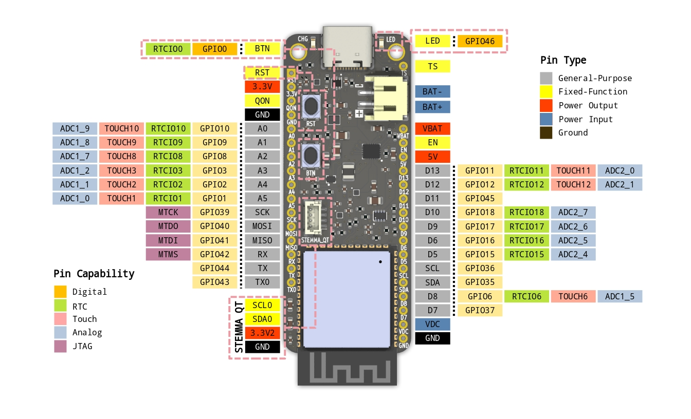

# Overview
*ESP32-S3 PowerFeather* is the ultimate development board for connected, LiPo-powered projects.

## Features

### Powerful brains

As the name suggests, the board features an Espressif ESP32-S3 module as the brains. When talking about this module, there are three main bullet points:

- speedy dual-core processor
- tons of flash and RAM
- awesome Wi-Fi and Bluetooth support

### Flexible Power

The board can be powered from three power input sources: USB, LiPo battery or an external DC supply. The board intelligently juggles between the three; all can be connected at the same time and pose no danger to the board or to the supplies!

In terms of power output, the board provides two 3.3V rails, one 5V rail, and one VBAT rail. The two 3.3V rails, one on header and the other on STEMMA QT connector, can be individually turned on or off. The 5V rail can be turned on even when only on battery power; and somewhat contrary to the name, is adjustable. The VBAT rail can be made to track battery voltage or set to a fixed voltage. In case of no or a fully depleted battery, VBAT still has power output as long as there is USB or DC power input.

### Low *Power*

*ESP32-S3 PowerFeather* uses components with low quiescent current, and the circuitry is designed carefully to minimize leakages. This results to one of the best-in-class deep-sleep current when compared against similar boards on the market.

The board even has power states with lower power consumption than deep-sleep for projects that can take advantage of it.

### Battery Smarts

For battery powered applications, it's important to know how much juice is left. That's why there's an onboard fuel gauge chip on *ESP32-S3 PowerFeather*. The board also comes with a modern, highly integrated battery charger chip. This charger chip has an I2C interface, which enables the firmware to set configuration or query status. The presence of these two chips enable users to design truly intelligent LiPo-powered applications.

### Expansions Galore

*ESP32-S3 PowerFeather* has a Feather-compatible form-factor, it can be used with [FeatherWings already existing on the market](https://github.com/adafruit/awesome-feather#featherwings). It also has a STEMMA QT connector, so [existing modules for it](https://github.com/adafruit/awesome-stemma#adafruit-sensors-with-stemma) can also be connected easily. Furthermore, there are several [STEMMA QT-compatible connector systems](https://github.com/adafruit/awesome-stemma#stemma-compatible-and-stemma-like-systems), so modules for these can be connected too! Examples of such are [QWIIC](https://cdn.sparkfun.com/assets/home_page_posts/3/1/7/7/SparkFun_s_Qwiic_Ecosystem.pdf) and [easyC](https://soldered.com/categories/easyc-2/) modules.

## Specifications

### Physical Dimensions
- Form factor
    - 23 mm x 57 mm x 6mm
    - USB-C connector
    - Feather-compatible
    - Mounting holes

### Core Components

- Module: ESP32-S3-WROOM-1-N16R8
    - Dual-core 240MHz Xtensa @ 240MHz
    - 16 MB SPI Flash, 768 KB SRAM + 8 MB PSRAM
    - 2.4 GHz Wi-Fi b/g/n
    - Bluetooth 5.0 LE + Mesh
- Battery Charger: BQ25628
- Fuel Gauge: LC709204F

### Power
- Current consumption
    - 1.5uA shutdown mode
    - 2uA ship mode
    - 10 uA deep sleep
    - 40 mA light sleep
    - 120 mA active
    - 250 mA Wi-Fi active
- Power Inputs
    - DC: 5.5V max, 2.5A max
    - USB: 5V max, 2.5A max
    - Battery: 3.7-4.2V, 6A max
- Power Outputs
    - 3.3V, 750 mA, two switchable outputs
    - 5V, (3.8 - 5.2V) 2A max
    - BAT, 3.7 - 4.2V, 3A max

### Battery
- Charging
    - Battery
        - 1S
        - Li-Ion/Li-Polymer, Lithium Phosphate/LiFePO4
    - 2A max current

### Operating Conditions

- Temperature:

### Interface
- Header
    - 23 digital input/output
    - 6 analog capable
    - 1 SPI
    - 1 I2C
- 1 STEMMA QT/QWIIC
    - User Button
    - Reset Button
    - User LED
    - Battery Charging LED

## Pinout

### Pin Type

1. General-Purpose - free pins for the user to configure and use in firmware
2. Fixed-function - pins that have a fixed function, carries a specific signal, or is connected to a specific component on the board
3. Power Input - used for connecting input power supplies
4. Power Output - used for connecting loads that get power from one of the board power output rails
5. Ground - ground reference for board and connected loads

### Pin Capability

1. Digital - pins that can output or accept input of 3.3V digital logic
2. RTC - pins that can hold output during deep-sleep; or be used as a wake source from deep-sleep
3. Touch - pins that can be used for capacitive touch input
4. Analog - pins that can read analog signals
5. JTAG - pins that connects to JTAG debugger

### Fixed-Function Pins

| Pin | Description |
|-|-|
|RST| ESP32-S3 Module Reset |
|EN| Board Enable |
|CHG| Battery Charger Status LED |
|ALARM| Fuel Gauge Alarm |
|INT| Battery Charger Interrupt |
|BTN| User Button |
|LED| User LED |
|SRC| USB or DC Power Source Indicator |

## Comparison
| Detail | ESP32-S3 PowerFeather | Unexpected Maker FeatherS3 | DFRobot ESP32 Firebeetle (DFR0654) |
|-|-|-|-|
| Module | ESP32-S3-WROOM-N16R8 | N/A1 | ESP32-WROOM-32E-N4 |
| Processor | ESP32-S3 | ESP32-S3 | ESP32 |
| Flash | 16MB | 16 MB | 4 MB |
| SRAM | 512 KB | 512 KB | 520 KB |
| PSRAM | 8MB | 8 MB | N/A |
| Wi-Fi | 2.4 GHz b/g/n | 2.4 GHz b/g/n | 2.4 GHz b/g/n |
| Bluetooth | Bluetooth 5 LE + Mesh | Bluetooth 5 LE + Mesh | Bluetooth 4.2 BR/EDR + LE |
| Deep Sleep Current | 10 uA | 20 uA | 13 uA2 |
| Lowest Power State/Current | Shutdown Mode/1.5 uA  | Deep Sleep/20 uA | Deep Sleep/13 uA |
| 3.3V Output Max Current | 750 mA | 2 x 700 mA | 600 mA |
| Turn On/Off 3.3V Output | Yes | Yes | No |
| 5V Output Max Current | 2 A | N/A3 | N/A3 |
| Max Charging Current (no board modifications) | 2 A4 | 330 mA5 | 500 mA5 |
| Battery charge measurement | Fuel Gauge Chip | Voltage divider6 | Voltage divider6 |
| STEMMA QT/QWIIC | 1 | 2 | N/A |
| Feather-compatible | Yes | Yes | No |
| Extra DC power input, aside from USB | Yes | No | No |
| Load while charging | Yes7 | Yes | Yes |
| Battery can temporarily supplement USB/DC supply | Yes7 | No | No |
| Battery power output when no/depleted battery, but has USB/DC supply | Yes7 | No | No |
| Castellated Header Pins | No | No | Yes |
| Header GPIOs | 23 input/output | 21 input/output | 18 input/output + 4 input only |
| Onboard LED | Charger Status + User LED | Charger Status + RGB User LED | Charger Status + RGB User LED 2
| Onboard Buttons | Reset + User Button | Reset + User Button | Reset + User Button
| USB Connector | USB-C | USB-C | USB-C |
| Native USB | Yes | Yes | No |
| Display Connector | No | No | 18-Pin FPC 8 |
| Price | $27 | $22 | $9 |

1. The *FeatherS3* does not use a module, instead using a bare ESP32-S3 chip. On the other hand, *ESP32-S3 PowerFeather* and *ESP32-Firebeetle* uses official Espressif modules, which comes with [certifications](https://www.espressif.com/en/support/documents/certificates?keys=&field_product_value%5B%5D=ESP32-S3-WROOM-1&field_product_value%5B%5D=ESP32-WROOM-32E).
2. To achieve low deep-sleep current consumption, an onboard trace on the *ESP32 Firebeetle* has to be cut which disables the onboard RGB LED.
3. On *FeatherS3* and *ESP32 Firebeetle*, the maximum 5V output current depends directly on the maximum current the USB input power supply can deliver.
4. The battery charger chip on the *ESP32-S3 PowerFeather* has an I2C interface, which can accept configuration command for setting the max charging current from the firmware. This makes it easy to set max charging current to balance charging speed and safety for a specific battery size.
5. On *FeatherS3* and *ESP32 Firebeetle*, a resistor on the board has to be replaced to change max charging current.
6. The voltage dividers on *FeatherS3* and *ESP32 Firebeetle* [may not be sufficient to determine the battery's state-of-charge](https://www.analog.com/jp/technical-articles/how-to-achieve-greater-accuracy-in-battery-capacity-readings-for-portable-designs.html).
7. *ESP32-S3 PowerFeather* battery charger chip has integrated power path management, which enables these features.
8. The 18-pin FPC on the *ESP32 Firebeetle* shares some GPIO pins with header; so pins used as part of the display interface can't be used on the header.

