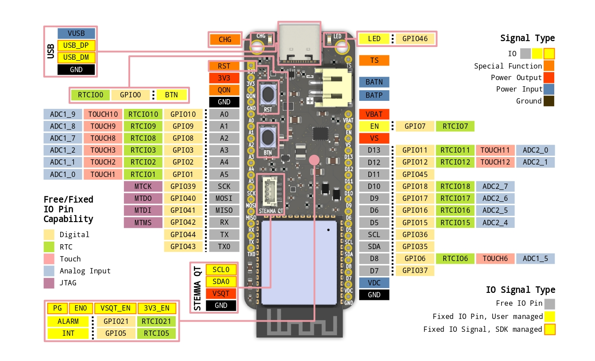

# Overview

## Features & Specifications

### Form Factor

- Board Dimensions
    - L: 57 mm
    - W: 23 mm
    - H: 6 mm
- [Feather-compatible](https://learn.adafruit.com/adafruit-feather/feather-specification)
    - 2 D=2.5mm mounting holes
    - 2 1x16 2.54 mm headers
- Connectors
    - 1 Battery JST PH 
    - 1 USB-C 
    - 1 STEMMA QT 

### Processing 

- 240 Mhz Dual-Core Xtensa LX7 Processor
- RISC-V / FSM Ultra Low Power Coprocessor
- 16 MB Quad-SPI Flash
- 8 MB Quad-SPI PSRAM
- 512 KB SRAM
- 16 KB RTC SRAM

### Connectivity

#### Radio
- 150 Mbps 2.4 GHz Wi-Fi 802.11b/g/n with on-board PCB antenna
- 2 Mbps Bluetooth 5 LE + Mesh with on-board PCB antenna

#### Input/Output
- USB OTG Full-Speed on USB-C connector
- 23 digital I/O pins on 2.54 mm headers
    - 6 analog output capable pin
    - 5 touch capable pin
    - 12 RTC capable pin
    - 3 UART, 2 SPI, 1 I2C, 1 I2S, 2 SDIO, 1 CAN on any pin
- 1 I2C via STEMMA QT connector
- 1 Red Charger Status LED
- 1 Reset Button
- 1 Green User LED
- 1 User Button

### Power

#### Input

- 5 V, 2 A `VUSB` via USB-C connector
- 3.9 V - 18 V, 2A via `VDC` pin
- 4.2 V, 2 A via battery JST PH connector

#### Output

- 3.3 V, 500 mA shared between `3V3` pin and `VSQT` on STEMMA QT connector
- 3.3 V - 4.2 V, 3 A via `VBAT` pin
- 5 V - 18 V, 2 A max via `VS` pin

#### Consumption

| State | Conditions | Current
|-|-|-|
|Active| External DC Supply (up to 18V) | Digital Output
|Deep-Sleep| External DC Supply (up to 18V) | Digital Output
|Ship Mode| External DC Supply (up to 18V) | Digital Output
|Shut Down| External DC Supply (up to 18V) | Digital Output

#### Battery

- Support Li-Ion/Li-Poly batteries with 3.7 V nominal, 4.2 V max voltage
- 2 A max charging current, configurable from firmware
- Battery Protections
    - Undervoltage: 2.2 V
    - Overvoltage: 4.37 V
    - Discharge overcurrent: 1.5 A
    - Trickle charging safety timer: 1 hr
    - Temperature cutoff: 0 °C and 60 °C (needs 10k NTC thermistor on battery)

## Pins & Signals

### Pin Type

1. General-Purpose - free pins for the user to configure and use in firmware
2. Fixed-function - pins that have a fixed function, carries a specific signal, or is connected to a specific component on the board
3. Power Input - used for connecting input power supplies
4. Power Output - used for connecting loads that get power from one of the board power output rails
5. Ground - 0 V reference for board and connected loads

### Pin Capability

1. Digital - pins that can output or accept input of 3.3 V digital logic
2. RTC - pins that can hold output during deep-sleep; or be used as a wake source from deep-sleep
3. Touch - pins that can be used for capacitive touch input
4. Analog - pins that can read analog signals
5. JTAG - pins that connects to JTAG debugger

### Power Pins

#### Power Input
| Pin | Description | Usage
|-|-|-|
|BAT-| Li-Ion/Li-Poly Negative Terminal | Digital/RTC Input
|BAT+| Li-Ion/Li-Poly Positive Terminal | Digital/RTC Input
|VUSB| USB 5V | Digital/RTC Input
|VDC| External DC Supply (up to 18V) | Digital Output

#### Power Output
| Pin | Description | Usage
|-|-|-|
|VBAT| Battery output | Digital/RTC Input
|VS| Higher of VDC or VUSB | Digital/RTC Input
|3V3| Header 3.3V | Digital/RTC Input
|VSQT| STEMMA QT 3.3V | Digital Output

### Fixed-Function Pins

#### Limited user control

While the following are fixed-function pins, user is able to have limited control of them - mostly to read or write
signal associated with them. User might want to setup interrupts, set as wake source for inputs, or do PWM for outputs.

| Pin | Description | Usage
|-|-|-|
|ALARM| Fuel Gauge Alarm | Digital/RTC Input
|INT| Battery Charger Interrupt | Digital/RTC Input
|BTN| User Button | Digital/RTC Input
|LED| User LED | Digital Output
|EN| Board Enable (active high) | Digital/RTC Input

Unlike other Feather boards, pulling `EN` low does not automatically disable power outputs. The firmware must detect that `EN` has been pulled low and disable desired power outputs.

#### User control not recommended

These are pins that are not recommended

| Pin | Description |
|-|-|
|USB_DP| USB Differential Pair + |
|USB_DM| USB Differential Pair - |
|SRC| USB or DC Power Source Indicator |
|3V3_EN| Header 3.3V Enable (active high) |
|VSQT_EN| STEMMA QT 3.3V Enable (active high) |

#### No user control

| Pin | Description |
|-|-|
|CHG| Battery Charger Status LED |
|RST| ESP32-S3 Module Reset |

## Comparison
| Detail | ESP32-S3 PowerFeather | Unexpected Maker FeatherS3 | DFRobot ESP32 Firebeetle (DFR0654) |
|-|-|-|-|
| Module | ESP32-S3-WROOM-N16R8 | N/A1 | ESP32-WROOM-32E-N4 |
| Processor | ESP32-S3 | ESP32-S3 | ESP32 |
| Flash | 16MB | 16 MB | 4 MB |
| SRAM | 512 KB | 512 KB | 520 KB |
| PSRAM | 8MB | 8 MB | N/A |
| Wi-Fi | 2.4 GHz b/g/n | 2.4 GHz b/g/n | 2.4 GHz b/g/n |
| Bluetooth | Bluetooth 5 LE + Mesh | Bluetooth 5 LE + Mesh | Bluetooth 4.2 BR/EDR + LE |
| Deep Sleep Current | 10 uA | 20 uA | 13 uA2 |
| Lowest Power State/Current | Shutdown Mode/1.5 uA  | Deep Sleep/20 uA | Deep Sleep/13 uA |
| 3.3V Output Max Current | 750 mA | 2 x 700 mA | 600 mA |
| Enable/Disable 3.3V Output | Yes | Yes | No |
| 5V Output Max Current | 2 A | N/A3 | N/A3 |
| Max Charging Current (no board modifications) | 2 A4 | 330 mA5 | 500 mA5 |
| Battery voltage measurement | Fuel Gauge | Voltage divider | Voltage divider |
| Battery state-of-charge (SOC) measurement | Fuel Gauge | Estimate using battery voltage6| Estimate using battery voltage6 |
| Battery state-of-health (SOH) measurement | Fuel Gauge | N/A | N/A |
| Battery charging/discharging time-to-full/time-to-empty estimate | Fuel Gauge | N/A | N/A |
| STEMMA QT/QWIIC | 1 | 2 | N/A |
| Feather-compatible | Yes | Yes | No |
| Extra DC power input, aside from USB | Yes | No | No |
| Load while charging | Yes7 | Yes | Yes |
| Battery can temporarily supplement USB/DC supply | Yes7 | No | No |
| Battery power output when no/depleted battery, but has USB/DC supply | Yes7 | No | No |
| Castellated Header Pins | No | No | Yes |
| Header GPIOs | 23 input/output | 21 input/output | 18 input/output + 4 input only |
| Onboard LED | Charger Status + User LED | Charger Status + RGB User LED | Charger Status + RGB User LED 2
| Onboard Buttons | Reset + User Button | Reset + User Button | Reset + User Button
| USB Connector | USB-C | USB-C | USB-C |
| Native USB | Yes | Yes | No |
| Display Connector | No | No | 18-Pin FPC 8 |
| Price | $29 | $22 | $9 |

1. The *FeatherS3* does not use a module, instead using a bare ESP32-S3 chip. On the other hand, *ESP32-S3 PowerFeather* and *ESP32-Firebeetle* uses official Espressif modules, which comes with [certifications](https://www.espressif.com/en/support/documents/certificates?keys=&field_product_value%5B%5D=ESP32-S3-WROOM-1&field_product_value%5B%5D=ESP32-WROOM-32E).
2. To achieve low deep-sleep current consumption, an onboard trace on the *ESP32 Firebeetle* has to be cut which disables the onboard RGB LED.
3. On *FeatherS3* and *ESP32 Firebeetle*, the maximum 5V output current depends directly on the maximum current the USB input power supply can deliver.
4. The battery charger chip on the *ESP32-S3 PowerFeather* has an I2C interface, which can accept configuration command for setting the max charging current from the firmware. This makes it easy to set max charging current to balance charging speed and safety for a specific battery size.
5. On *FeatherS3* and *ESP32 Firebeetle*, a resistor on the board has to be replaced to change max charging current.
6. Estimation of state-of-charge using battery voltage on *FeatherS3* and *ESP32 Firebeetle* [may not be sufficient](https://www.analog.com/jp/technical-articles/how-to-achieve-greater-accuracy-in-battery-capacity-readings-for-portable-designs.html).
7. *ESP32-S3 PowerFeather* battery charger chip has integrated power path management, which enables these features.
8. The 18-pin FPC on the *ESP32 Firebeetle* shares some GPIO pins with header; so pins used as part of the display interface can't be used on the header.

## Links

### Datasheets

- Module: ESP32-S3-WROOM-1-N16R8
- Battery Charger: BQ25628E
- Battery Fuel Gauge: LC709204F
- 3.3V Regulator: TPS62840

### Hardware Files

https://github.com/PowerFeather/esp32s3-powerfeather