---
keywords:
    - esp32
    - powerfeather
    - example
    - demo
    - sdk
    - get started
    - arduino
    - esp-idf
sidebar_position: 1
---

# Getting Started

## Quick Check

PowerFeather comes pre-loaded with a program that blinks the green user `LED`. Use this to quickly check
if your board is OK. Simply connect your PowerFeather to a host computer using the USB-C connector:


The red `CHG` LED should flash momentarily, after which the green user `LED` blinks continuously.

## Run Example

The demo application showcases how to get basic information from the supply and battery. To build and flash the demo,
ESP-IDF or Arduino with the *PowerFeather SDK* must be installed on your system. If you have not done this yet,
please go through [PowerFeather SDK Setup](/sdk/setup.md) first.

### Arduino

On a host computer, open the Arduino IDE. Then open the example *PowerFeather-SDK* > *SupplyAndBatteryInfo*.

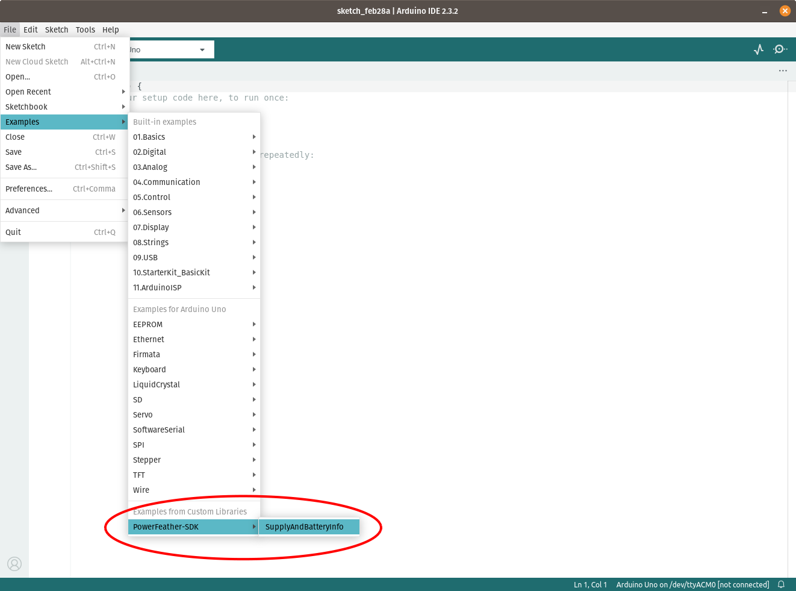

[Connect the battery](../hardware/esp32s3.md#battery-polarity) first if you have one, before connecting PowerFeather to the host computer.
Once it is connected open the board selector drop-down, click *Select other board and port* and choose *ESP32-S3 PowerFeather*.

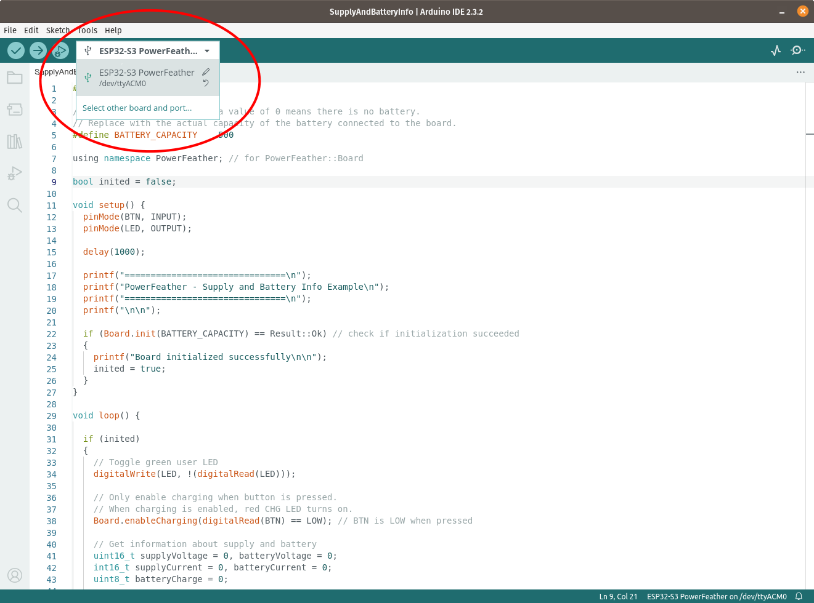

Upload the example, then open the *Serial Monitor* when done.

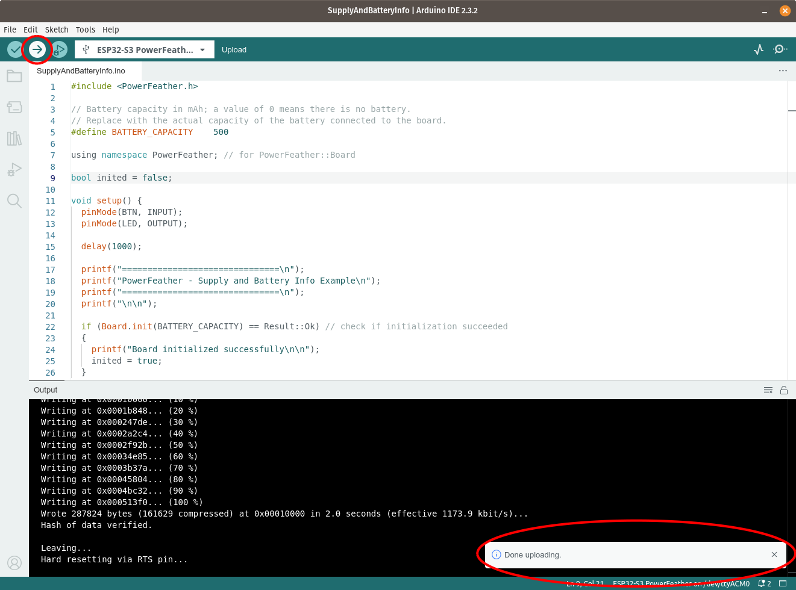
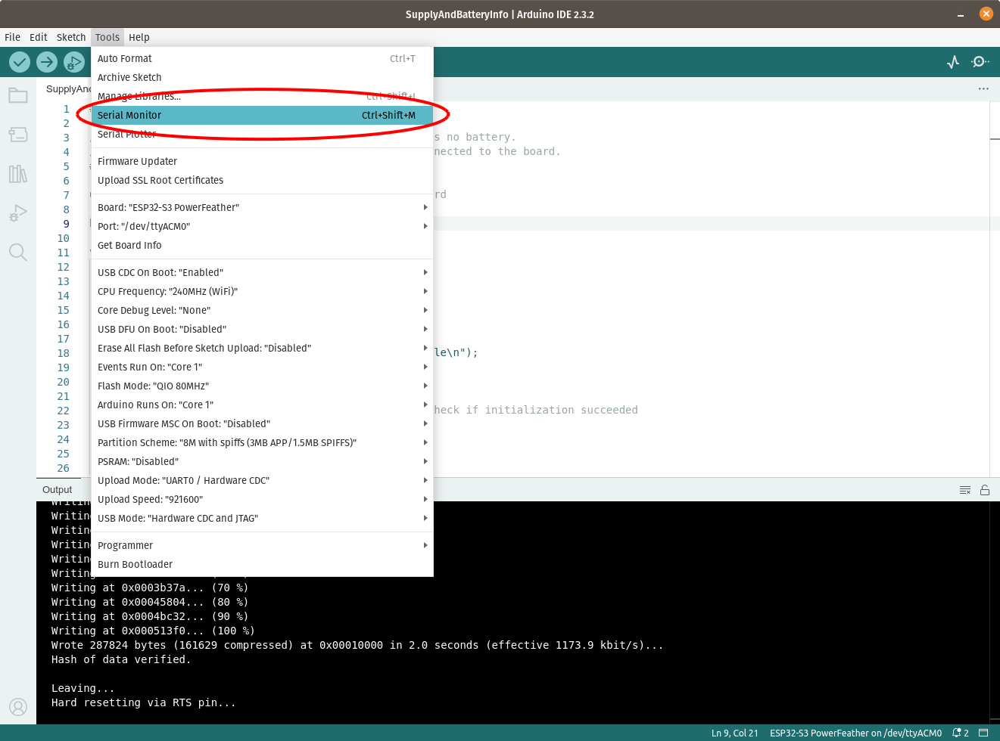

On the *Serial Monitor*, you should see the supply and battery voltage and current reported; as well as the
estimated battery charge percentage by the fuel gauge. Notice that the battery current is zero, while the supply current is not.
This indicates that:
- The board is being powered by the USB supply and not the battery.
- The battery is not charging.

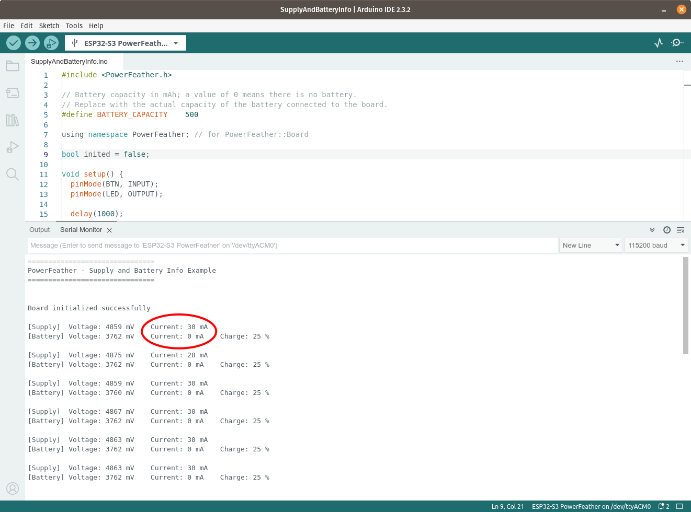

Press and hold `BTN` on PowerFeather to enable charging. Notice the battery current is no longer zero, and supply current is
more than before.

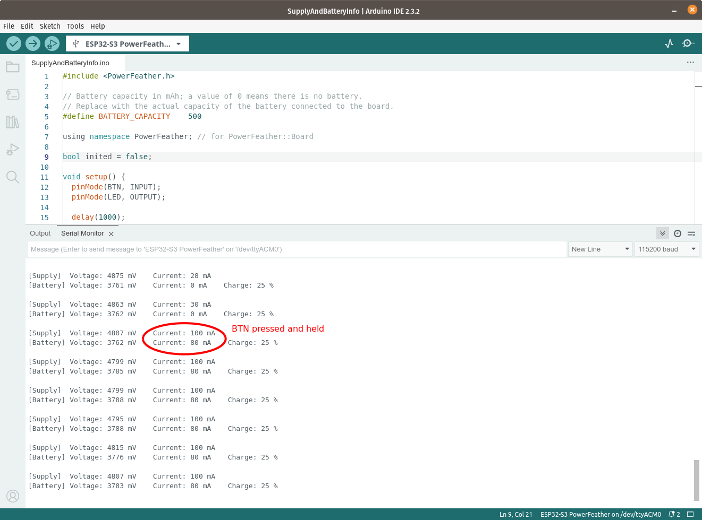

If you have or can make one, try using a data-only USB cable. With the USB supply absent, the battery powers the board and discharges.
In this case, the measured battery current is negative.

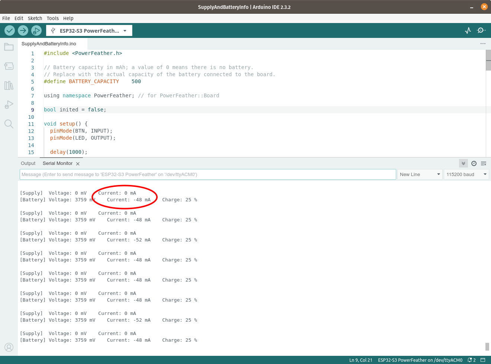

### ESP-IDF

On Mac OS and Linux, open a terminal with the [ESP-IDF environment loaded](https://docs.espressif.com/projects/esp-idf/en/latest/esp32/get-started/linux-macos-setup.html#step-4-set-up-the-environment-variables). On Windows open the [ESP-IDF Command Prompt or ESP-IDF PowerShell](https://docs.espressif.com/projects/esp-idf/en/latest/esp32/get-started/windows-setup.html#launching-esp-idf-environment).

Navigate to a directory where the example project can be downloaded to and run the following command:

```bash
idf.py create-project-from-example "powerfeather/powerfeather-sdk^1.0.0:supply_and_battery_info"
```
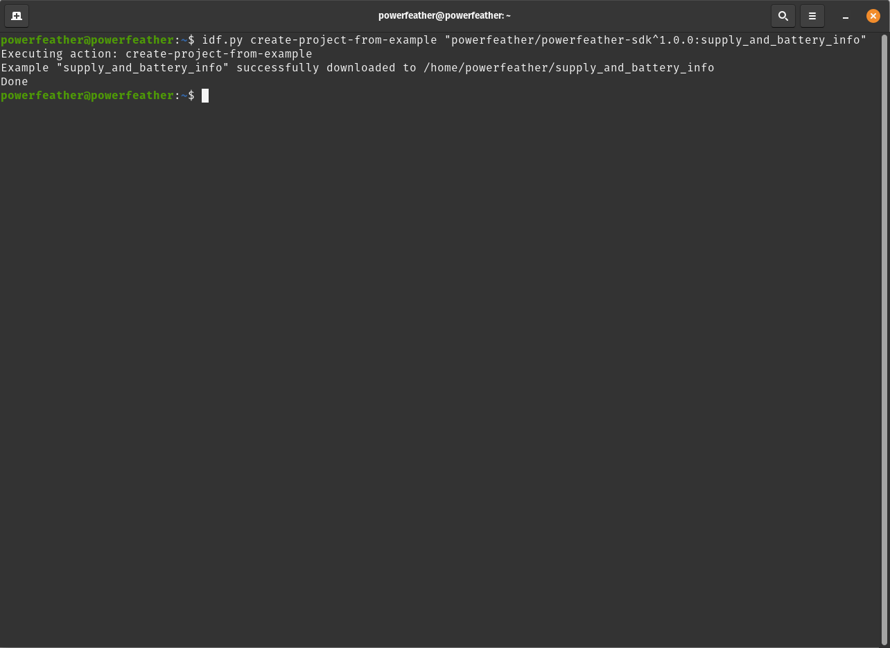

[Connect the battery](../hardware/esp32s3.md#battery-polarity) first if you have one, before connecting PowerFeather to the host computer.
Once connected `cd` into the just downloaded *supply_and_battery_info* directory, then build and flash the example using the commands:

```bash
idf.py set-target esp32s3
idf.py flash monitor
```

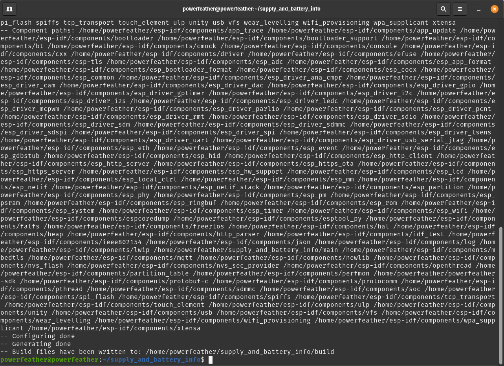
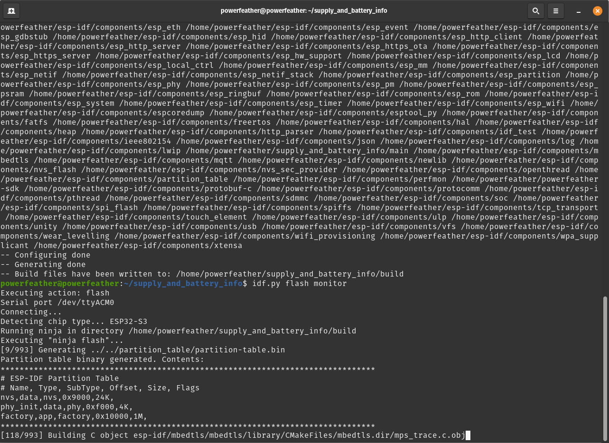

Run `idf.py monitor`. You should see the supply and battery voltage and current reported; as well as the
estimated battery charge percentage by the fuel gauge. Notice that the battery current is zero, while the supply current is not.
This indicates that:
- The board is being powered by the USB supply and not the battery.
- The battery is not charging.

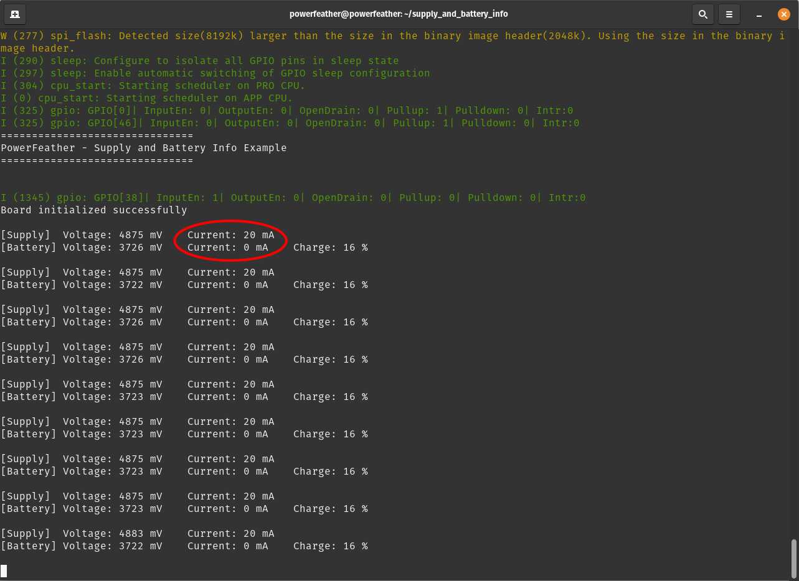

Press and hold `BTN` on PowerFeather to enable charging. Notice the battery current is no longer zero, and supply current is
more than before.

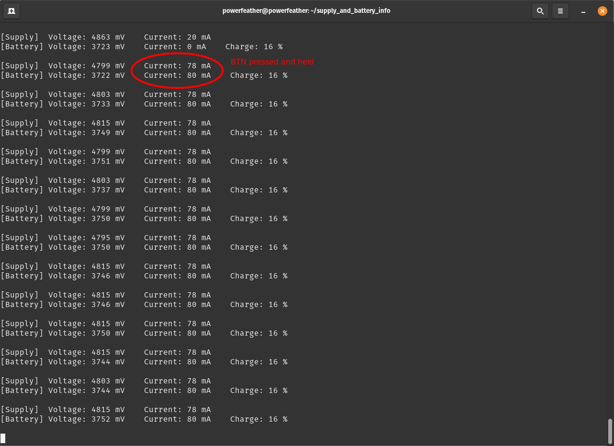

If you have or can make one, try using a data-only USB cable. With the USB supply absent, the battery powers the board and discharges.
In this case, the measured battery current is negative.

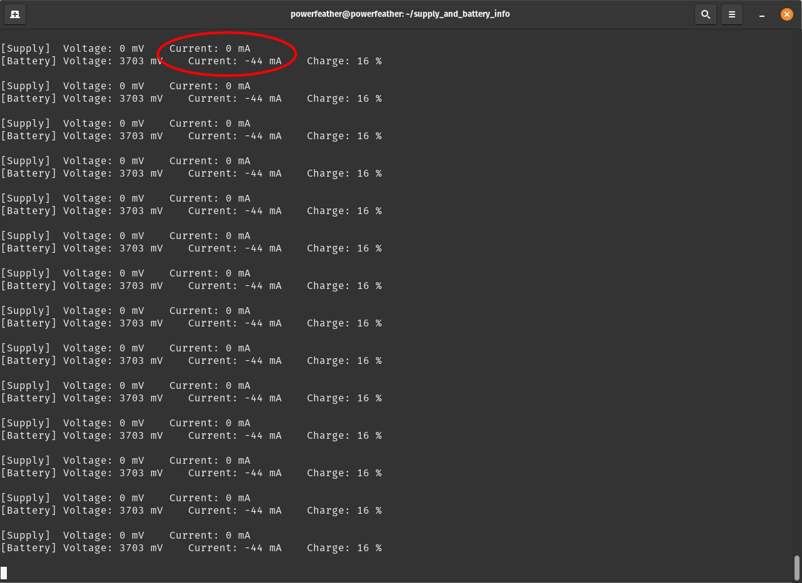