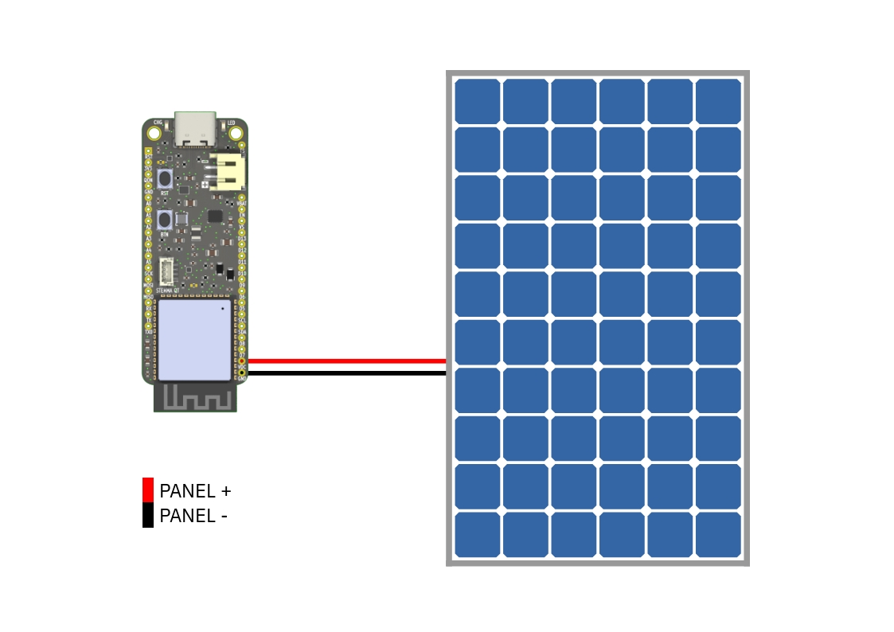

---
keywords:
    - esp32
    - powerfeather
    - solar panel
    - mppt
sidebar_position: 3
---

# Using a Solar Panel


## Selection

Choose a solar panel that has an open-circuit voltage not exceeding 18 V, and an MPP voltage from 4.6 V to 16.8 V.

:::caution
Pay close attention to solar panels advertised as 12 V, as most of them actually have a much higher
open-circuit voltage of around 21 V - which exceeds the 18 V limit for `VDC`.
:::

A 10 W panel in ideal conditions should be able to saturate the maximum battery charging current of 2 A.
However, if you don't need a charging current that high, you may opt for a smaller wattage, and consequently
physically smaller, solar panel.

The following are solar panels we have tested first-hand to work well with PowerFeather:

| Name | Wattage | MPP voltage | Open-circuit voltage | Purchase Link
|-|-|-|-|-|
| [PowerFeather Solar Panel](/hardware/solar_panel) | 10 W | 12 V | 13.9 V | https://www.elecrow.com/powerfeather-solar-panel.html |
| NETCOMLAB COV-35105  | 10 W | 15 V | 16.5 V | https://www.kobetradingusa.com/products/cov-35105-solar-panel-15v-10w |

## Connection



Simply connect the solar panel's positive and negative terminal to the PowerFeather's `VDC` and `GND`
pin, respectively.


:::info
If you are using a solar panel with a center-positive barrel jack (like the PowerFeather Solar Panel), you might be interested in the
[PowerFeather ProtoWing](/hardware/protowing) which has a barrel connector and can be connected to `VDC` and `GND` of PowerFeather.
:::

:::danger
There is no reverse polarity protection on `VDC` and `GND`, so ensure that solar panel terminals are connected
with correct polarity. Incorrect polarity can cause permanent damage to PowerFeather and/or the solar panel.
:::


## Code

In order to maximize power from the solar panel, the MPP voltage should be set. It can be done by calling
[Mainboard::setSupplyMaintainVoltage](../sdk/api/mainboard.md#result-setsupplymaintainvoltageuint16_t-voltage) in your code
with the panel's MPP voltage as argument (in millivolts).

For example, for the PowerFeather Solar Panel, it would be:

```cpp
Board.init(500); // Assuming a 500 mAh battery
// ...
Board.setSupplyMaintainVoltage(12000); // PowerFeather Solar Panel MPP voltage = 12000 mV
```