---
keywords:
    - esp32
    - powerfeather
    - low power
    - solar panel
    - power management
    - power monitoring
    - lipo
    - battery
    - li-ion
    - current measurement
    - charger
    - fuel gauge
    - feather
    - stemma qt
sidebar_position: 0
slug: /
---

# ESP32-S3 PowerFeather

## Features & Specifications

### Physical

- Board Dimensions: 65 mm L x 23 mm W  x 7 mm H
- Feather-compatible format, Feather Wings support
- Board Features
    - USB-C connector
    - Two 2.5 mm mounting holes
    - Two 1x16 2.54 mm header pin holes
    - Thermistor pin hole
    - 2-pin JST PH Li-ion/LiPo battery connector
    - 4-pin JST SH STEMMA QT connector
    - Green user LED
    - Red charger status LED
    - User button
    - Reset button
    - On-board PCB antenna

### Capabilities

#### Compute Resources

- 240 Mhz Dual-Core Xtensa LX7 Processor
- RISC-V / FSM Ultra Low Power Coprocessor
- 8 MB Quad-SPI Flash
- 2 MB Quad-SPI PSRAM
- 512 KB SRAM
- 16 KB RTC SRAM

#### Power Management

- Supply Monitoring
    - Current measurement
    - Voltage measurement
    - Good supply detection
- Supply Management
    - Set maintained supply voltage (can be used to set MPP voltage)
- Battery Monitoring
    - Voltage measurement
    - Temperature measurement
    - Current measurement (charge/discharge)
    - Charge estimation
    - Health & cycle count estimation
    - Time-to-empty and time-to-full estimation
    - Low charge, high/low voltage alarm
- Battery Management
    - Enable/disable charging
    - Set max charging current
- Others
    - `3V3` enable/disable
    - `VSQT` enable/disable
    - FeatherWing enable/disable via `EN` pin
    - Power States
        - Ship mode
        - Shutdown mode
        - Power cycle
    - Battery Protections
        - Undervoltage Detect @2.2 V, Release @2.4 V
        - Overvoltage Detect @4.37 V, Release @4.28 V
        - Overcurrent protection @3A
        - Trickle charging safety timer @1 hr
        - Temperature-based charging current reduction based on JEITA, cutoff at 0 °C and 50 °C.

### Interfaces

#### Radio
- 2.4 GHz Wi-Fi 802.11b/g/n on PCB antenna
- Bluetooth 5 LE + Mesh on PCB antenna

#### Connectors
- USB 1.1 Full-Speed OTG on USB-C connector
- I2C on STEMMA QT connector

#### Pin Holes
- 23 I/O on the two 1x16 2.54 mm pitch header pin holes
    - All digital input and output capable
    - All UART, I2C, SPI, I2S, SDIO, PWM, CAN, RMT, Camera, LCD capable
    - 6 analog input capable
    - 5 touch input capable
    - 12 RTC capable (deep sleep pin hold, wake-up source)
- Semitec 103AT input on thermistor pin hole

### Power

#### Input

- 5 V, 2 A max on `VUSB` USB-C connector
- 5 V - 18 V, 2A max on `VDC` header pin
- 4.2 V max, 2 A max on `BATP` and `BATN` JST PH Li-ion/LiPo battery connector

#### Output

- 3.3 V, 1 A max shared between board, `3V3` header pin and `VSQT` STEMMA QT connector
- 3.3 V - 4.2 V, 3 A max shared between board and `VBAT` header pin
- 5 V - 18 V, 2 A max shared between board and `VS` header pin

#### Current Consumption

| Power State | `BATP` Current |
|-|-|
|Deep-Sleep, Fuel Gauge Enabled (Initial) | 26 μA |
|Deep-Sleep, Fuel Gauge Enabled (Settled) | 18.5 μA |
|Deep-Sleep, Fuel Gauge Disabled | 18 μA |
|Ship Mode, Fuel Gauge Disabled | 1.5 μA |
|Shutdown Mode, Fuel Gauge Disabled | 1.4 μA |

## Pins & Signals

[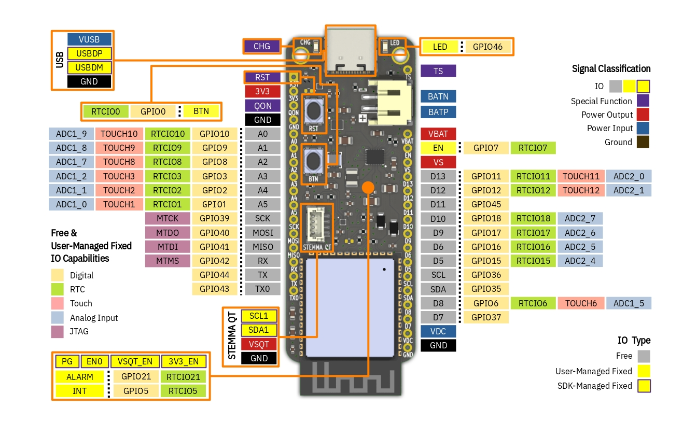](assets/esp32s3/pinout.jpg)

### IO

These are signals routed to the ESP32-S3 GPIO pins.

#### Free IO

IO signals not connected to anything on-board; user code is free to configure and use these for any purpose
within their respective GPIO capabilities. Note that the `Description` and `Name` are only for compatibility with the
Feather specification, and does not strictly define the functionality of the IO. For example,
there are other pins that can be used as analog inputs outside of `A0` - `A5`, such as `D8` which is `ADC1_5`.
Another example is that IO other than `MOSI`, `MISO` and `SCK` can also be used for SPI - it's not limited to these ones.

|Name| Description | Digital | Analog Input | RTC | Touch | JTAG |
|-|-|-|-|-|-|-|
| A0 | Analog Input 0 | GPIO10 | ADC1_9 | RTCIO10 | TOUCH10 | |
| A1 | Analog Input 1 | GPIO9 | ADC1_8 | RTCIO9 | TOUCH9 | |
| A2 | Analog Input 2 | GPIO8 | ADC1_7 | RTCIO8 | TOUCH8 | |
| A3 | Analog Input 3 | GPIO3 | ADC1_2 | RTCIO3 | TOUCH3 | |
| A4 | Analog Input 4 | GPIO2 | ADC1_1 | RTCIO2 | TOUCH2 | |
| A5 | Analog Input 5 | GPIO1 | ADC1_0 | RTCIO1 | TOUCH1 | |
| D5 |  Digital Input/Output 5 | GPIO15 | ADC2_4 | RTCIO15 | | |
| D6 |  Digital Input/Output 6 | GPIO16 | ADC2_5 | RTCIO16 | | |
| D7 |  Digital Input/Output 7 | GPIO37 | | | | |
| D8 |  Digital Input/Output 8 | GPIO6 | ADC1_5 | RTCIO6 | TOUCH6 | |
| D9 |  Digital Input/Output 9 | GPIO17 | ADC2_6 | RTCIO17 | | |
| D10 | Digital Input/Output 10 | GPIO18 | ADC2_7 | RTCIO18 | | |
| D11 | Digital Input/Output 11 | GPIO45 | | | | |
| D12 | Digital Input/Output 12 | GPIO12 | ADC2_1 | RTCIO12 | TOUCH12 | |
| D13 | Digital Input/Output 13 | GPIO11 | ADC2_0 | RTCIO11 | TOUCH11 | |
| MOSI | SPI MOSI | GPIO40 | | | | MTDO |
| MISO | SPI MISO | GPIO41 | | | | MTDI |
| SCK | SPI SCK | GPIO39 | | | | MTCK |
| RX | UART RX | GPIO42 | | | | MTMS |
| TX | UART TX | GPIO44 | | | | |
| TX0 | Serial Log Output | GPIO43 | | | | |
| SCL | I2C SCL | GPIO36 | | | | |
| SDA | I2C SDA | GPIO35 | | | | |

##### Capabilities

- Digital - IO that can output or accept input of 3.3 V digital logic; supports UART, I2C, SPI, I2S, SDIO, PWM, CAN, RMT, Camera, and LCD peripheral.
- RTC - IO that can hold output state during deep-sleep; or be used as a wake-up source from deep-sleep.
- Touch - IO that can be used as capacitive touch input.
- Analog Input - IO that can read analog signals; `X`, `Y` in `ADCX_Y` denotes the ADC number and channel respectively.
- JTAG - IO that can be used for JTAG debugging.

#### User-Managed Fixed IO

IO signals connected to a component on-board, limiting its use. For example, it does not make sense to use `BTN` as UART TX due to being connected to a button, even though it is technically capable of doing so. User code is still in control in terms of configuring and using these IO.

| Pin | Description | Digital | RTC |
|-|-|-|-|
| ALARM | Battery Fuel Gauge Alarm Input | GPIO21 | RTCIO21 |
| INT | Battery Charger Interrupt Input | GPIO5 | RTCIO5 |
| BTN | User Button Input | GPIO0 | RTCIO0 |
| LED | Green User LED Output | GPIO46 | RTCIO7 | |

#### SDK-Managed Fixed IO

IO signals connected to a component on-board, whose configuration and use is managed by the SDK. User code should not configure and use these IO, as doing so can cause faulty behavior.

| Pin | Description |
|-|-|
| USB_DP | USB Data Positive |
| USB_DM | USB Data Negative |
| PG | Power Supply Good Indicator Input |
| 3V3_EN | 3V3 Enable Output|
| VSQT_EN | VSQT Enable Output |
| EN0 | Board Enable Output |
| SCL1 | STEMMA QT I2C SCL |
| SDA1 | STEMMA QT I2C SDA |

### Special Function

Signals not routed to the ESP32-S3 GPIO pins, or are routed to other integrated circuits on-board such as the battery charger and fuel gauge.

| Name | Description |
|-|-|
| CHG | Battery Charger Status LED |
| RST | ESP32-S3 Module Reset |
| QON | Ship Mode Exit |
| TS | Semitec 103AT Thermistor Input |
| EN | Feather Wing Enable Output |

### Power Input

Supplies power to the board.

| Name | Description
|-|-|
| BATN | Li-ion/LiPo Negative Terminal |
| BATP | Li-ion/LiPo Positive Terminal |
| VUSB | 5V USB Power Input |
| VDC | 3.8 V - 18 V Header Pin Input |

### Power Output

Powers loads connected to the board. Please don't connect power supplies to these.

| Name | Description
|-|-|
| VBAT | 3.7 V - 4.2 V Battery Output |
| VS | 3.8 V - 18 V Supply Voltage; Higher of `VDC` and `VUSB` |
| 3V3 | Header Pin 3.3 V Output |
| VSQT | STEMMA QT 3.3 V Output |

### Ground

0 V reference for the components on-board, input power supplies and connected loads.

| Name | Description |
|-|-|
|GND| Ground Pin |

## Notes

### Feather Differences

While ESP32-S3 PowerFeather is largely compatible with the Adafruit Feather ecosystem, it has has a few deviations from the [Feather specification](https://learn.adafruit.com/adafruit-feather/feather-specification).

- `EN` Behavior

    On standard Feather boards, the `EN` pin is connected to the enable pin of the on-board 3.3 V regulator. Pulling `EN` low means disabling the 3.3 V regulator and everything powered from it.

    On PowerFeather, `EN` is connected to an ESP32-S3 IO pin. User code can read the state of this pin and act accordingly, i.e. it can disable the `3V3` and `VSQT` load switches and put itself to deep-sleep to emulate behavior on standard boards; or it might do something completely different.

    Furthermore, the ESP32-S3 itself can pull `EN` low if user code needs to disable connected Feather Wings.

- `QON` Pull-Up

    `QON` replaces `AREF` on ESP32-S3 PowerFeather, and is normally pulled high up to 5 V. Make sure when connecting Feather Wings that it is able to handle this voltage on its `AREF` pin, or the Feather Wing does not use `AREF` at all.

    If this is an issue, `QON` can be removed by breaking a solder bridge labeled `B2`.

- `VS` Up to 18 V

    On standard Feather boards, the pin at the same position as `VS` is the 5 V output (there is no on-board 5 V regulator, the 5 V comes from the USB supply). On PowerFeather, `VS` outputs either `VUSB` or `VDC`, whichever has a higher voltage. Since `VDC` can be up to 18 V, this means that `VS` can also be up to 18 V.

    Keep this in mind if using a power supply with voltage higher than 5 V on `VDC`, as it might destroy Feather Wings that only expects 5 V on its `VS`/`5V` pin.

### Soldering Headers

Due to the ESP32-S3 module's size, some of the header holes are awfully close its pads. This means that in these areas, there is a risk of shorting a hole with a pad when soldering headers.

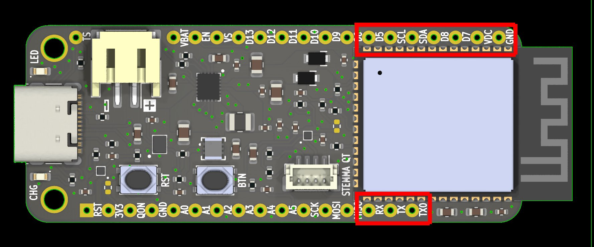

This is especially dangerous with VDC, since it is a high voltage power input (up to 18 V) that would most likely fry the ESP32-S3 if it comes in contact with one of its pads.
It would be wise to check for shorts using a multimeter after soldering headers, just to be safe.

### Battery Polarity

The wiring polarity for batteries with JST-PH connectors is not standardized. Please make sure the batteries you use are wired with the correct polarity - it is printed
on the silkscreen!

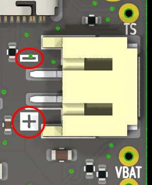

### Miscelleanous Questions

- Can `VUSB` and `VDC` be plugged in at the same time?

    `VUSB` and `VDC` are or'ed with schottky diodes, so it's safe to have them plugged in at the same time. The schottky diodes ensure
    that current does not flow from `VDC` to `VUSB` or vice versa depending on which is higher. The higher voltage of the two
    supplies PowerFeather; if they are around the same voltage, they share the current load for PowerFeather
    and all connected devices.

- Can power be drawn by the board or connected loads while charging?

    PowerFeather uses a charger IC that implements a power path, so it is safe to have PowerFeather and connected devices draw power while
    charging the battery. Furthermore, the power path allows the battery to supplement `VUSB` or `VDC` during load power spikes to prevent brownouts.
    Also, if there is `VDC` or `VUSB`, but there is no battery or the battery is fully depleted, `VBAT` is still regulated to 3.7 V.

- Does ESP32-S3 PowerFeather support LiFePO4/LFP?

    The board as a whole does not support LiFePO4 batteries. While the charger IC supports LiFePO4, the fuel gauge IC does not. Furthermore,
    PowerFeather uses a linear regulator to provide the 3.3 V power rail, which won't function properly under a LiFePO4 battery with nominal voltage of 3.2 V.

- What do you mean by near/pseudo-MPPT?

    PowerFeather does not support 'true' MPPT in the sense that it does not do full tracking of the panel's I-V curve. However, the panel MPP voltage can be set, and the charger IC will dynamically regulate charging current to prevent the panel voltage from collapsing below it. This provides near/pseudo-MPPT performance, since the MPP voltage for a typical panel remains roughly the same across various illumination levels.

    For more details, please read [this Adafruit design note](https://learn.adafruit.com/adafruit-bq24074-universal-usb-dc-solar-charger-breakout/design-notes) for one of their solar chargers that uses the same dynamic charging current regulation technology. However, the advantage of PowerFeather compared to their solar charger is that their solar charger has a fixed MPP voltage at 4.5 V, while for PowerFeather it can be adjusted in firmware up to 16.8 V.

## Appendix

### Current Measurements

These are measurements for the figures in [Current Consumption](#current-consumption). These were measured using Nordic [Power Profiler Kit II](https://www.nordicsemi.com/Products/Development-hardware/Power-Profiler-Kit-2) (a.k.a PPK2) acting as a battery @3.7 V plugged into `BATP` and `BATN`; and with no external supply (`VBUS` or `VDC`).

| Deep Sleep, Fuel Gauge Enabled (Initial) | Deep Sleep, Fuel Gauge Enabled (Settled) |
|-|-|
| [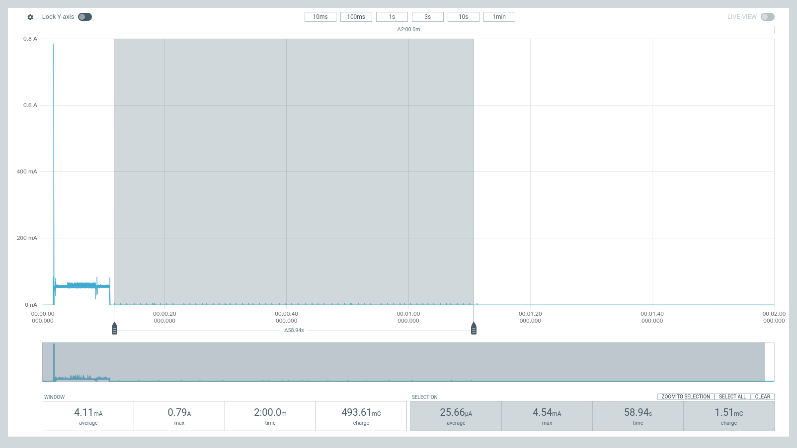](assets/esp32s3/current_measurements/fg_on_initial.png)   The fuel gauge *initially* samples around every ~1 s, with each sample registering a current spike to up ~5 mA. | [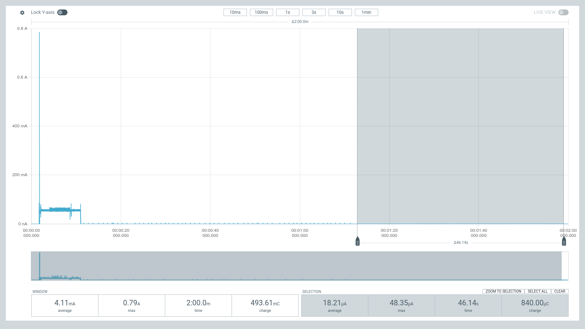](assets/esp32s3/current_measurements/fg_on_settled.png)   The fuel gauge samples *settles* down to around every ~2 s, with each sample registering a current spike up to ~50 μA. |

| Deep Sleep, Fuel Gauge Disabled | Ship Mode, Fuel Gauge Disabled | Shutdown Mode, Fuel Gauge Disabled |
|-|-|-|
| [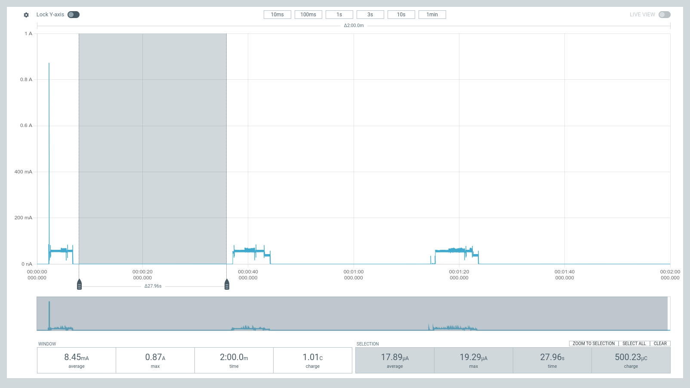](assets/esp32s3/current_measurements/fg_off.png) | [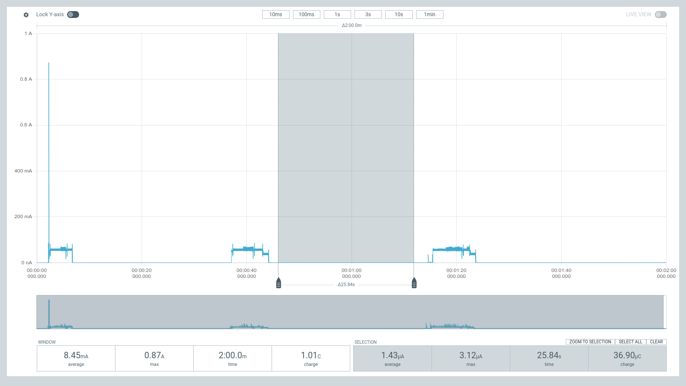](assets/esp32s3/current_measurements/fg_off_ship.png) | [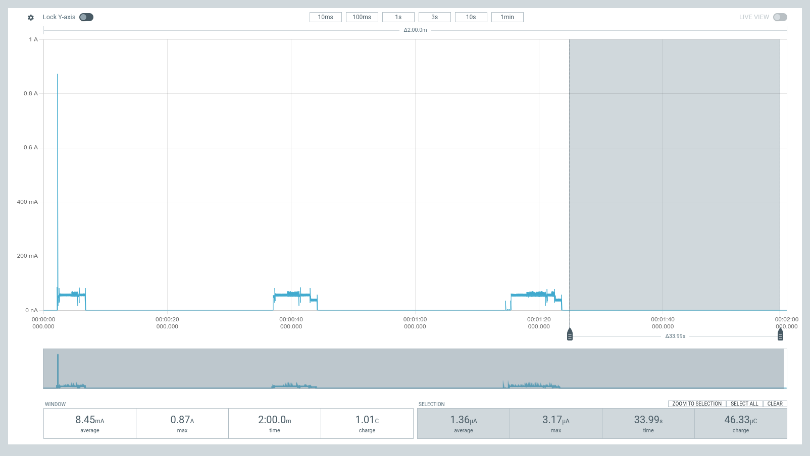](assets/esp32s3/current_measurements/fg_off_shutdown.png) |

You can download the raw traces obtained from PPK2 using the links below, and open them with your [nRF Connect Power Profiler Software](https://www.nordicsemi.com/Products/Development-tools/nRF-Connect-for-Desktop).

- [Current measurement trace for deep sleep with fuel gauge enabled - initial and settled](assets/esp32s3/current_measurements/ppk_trace_fg_on_initial_and_settled.ppk)
- [Current measurement trace for deep dleep with duel gauge gisabled, ship mode and shutdown mode](assets/esp32s3/current_measurements/ppk_trace_fg_off_ship_and_shutdown.ppk)

### Key Components

| Component | Manufacturer | Part | Datasheet |
|-|-|-|-|
| Microcontroller & WiFi + Bluetooth LE SoC | Espressif | ESP32-S3-WROOM-1 | https://www.espressif.com/sites/default/files/documentation/esp32-s3-wroom-1_wroom-1u_datasheet_en.pdf |
| Battery Charger | Texas Instruments | BQ25628E | https://www.ti.com/lit/ds/symlink/bq25628e.pdf?ts=1712390973163&ref_url=https%253A%252F%252Fwww.google.com%252F |
| Battery Fuel Gauge | Onsemi | LC709204F | https://www.onsemi.com/pdf/datasheet/lc709204f-d.pdf |
| 3.3 V Regulator | Torex | XC6220 | https://product.torexsemi.com/system/files/series/xc6220.pdf |

### Showcase

#### Video

A showcase video for the ESP32-S3 PowerFeather can be found on Youtube, which contains:

- Hardware Tour
- Power Features & Capabilities
- Demonstrations
    - Power Inputs
    - Ship Mode & Deep Sleep Current
    - Enable/Disable 3.3V Outputs
    - Charging Controls
    - Battery Temperature Sensing
    - Setting MPP Voltage

<iframe
  width="100%" style={{"aspect-ratio": "16 / 9"}}
  src="https://www.youtube.com/embed/VF9AFk1Hf88"
  frameborder="0"
  allow="autoplay; encrypted-media"
  allowfullscreen>
</iframe>

#### Articles

Parts of the showcase video can also be found in written format on:

- [Hackaday](https://hackaday.io/project/196835-esp32-s3-powerfeather)
- [Hackster](https://www.hackster.io/powerfeatherdev/esp32-s3-powerfeather-power-management-monitoring-3ed26f)
- [Electromaker](https://www.electromaker.io/project/view/esp32-s3-powerfeather-demonstrations?srsltid=AfmBOorDdO7lgxecP5gK1wmrVW1ibI68bCeYyku7K_SxBEnhQZW07pZ4)

### Photos

| [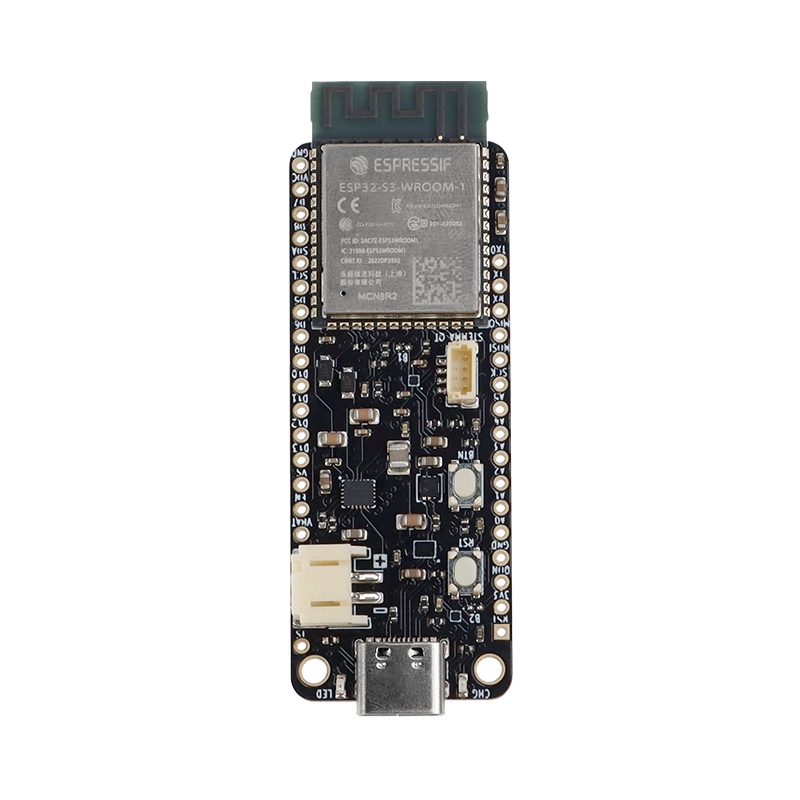](assets/esp32s3/photos/1.jpg) | [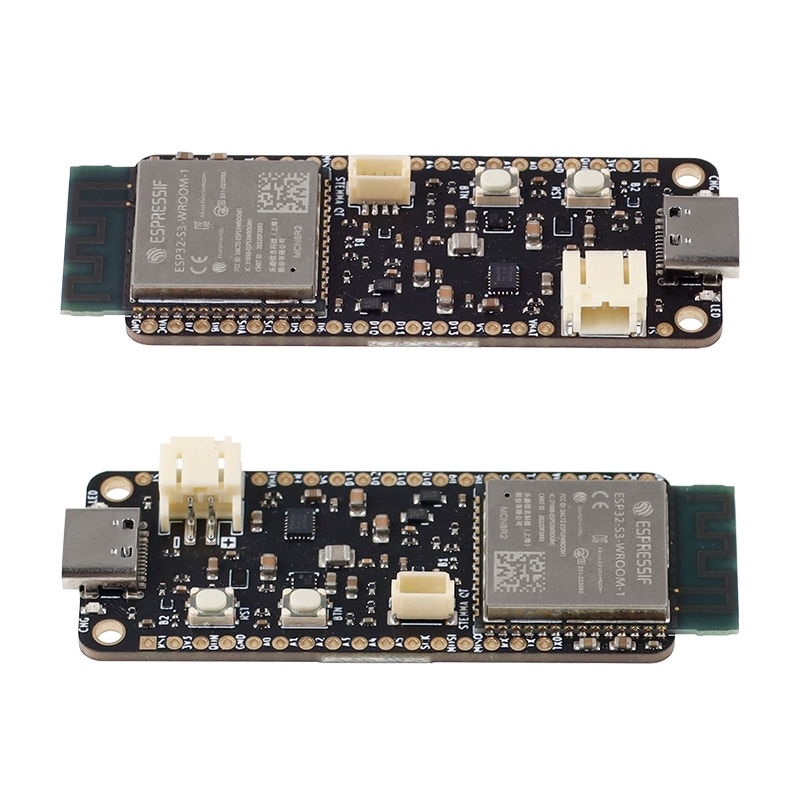](assets/esp32s3/photos/4.jpg) | [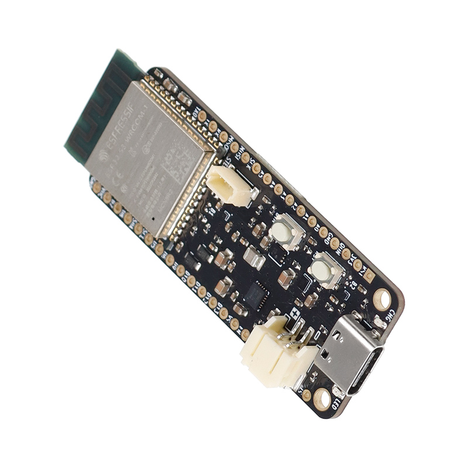](assets/esp32s3/photos/5.jpg) | [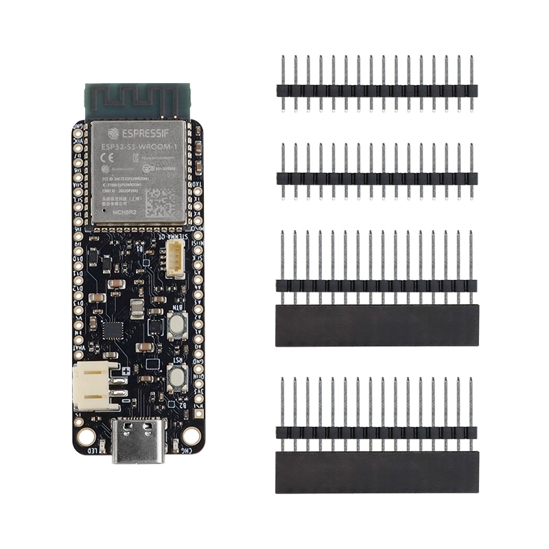](assets/esp32s3/photos/2.jpg) | [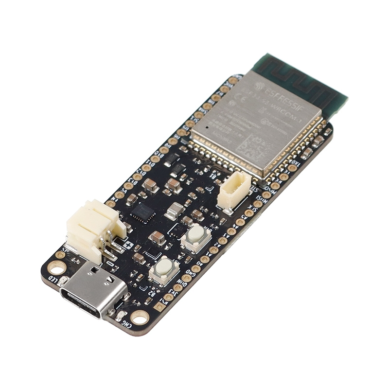](assets/esp32s3/photos/3.jpg) |
|-|-|-|-|-|