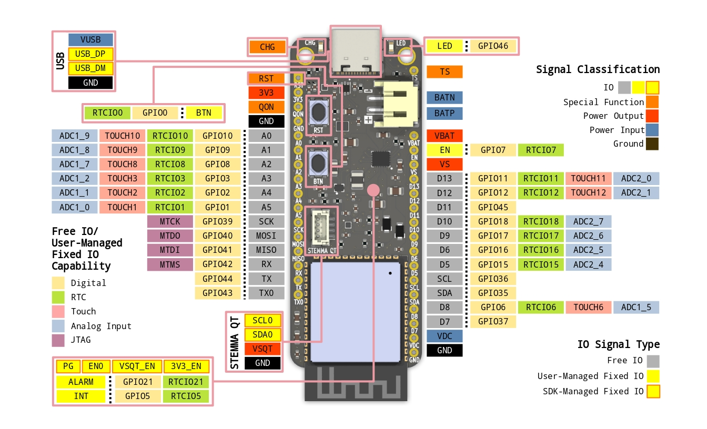

# ESP32-S3 PowerFeather

## Features & Specifications

### Form Factor

- Board Dimensions
    - L: 57 mm
    - W: 23 mm
    - H: 6 mm
- [Feather-compatible](https://learn.adafruit.com/adafruit-feather/feather-specification)
    - 2 D=2.5mm mounting holes
    - 2 1x16 2.54 mm headers
- Connectors
    - 1 Battery JST PH
    - 1 USB-C
    - 1 STEMMA QT

### Processing

- 240 Mhz Dual-Core Xtensa LX7 Processor
- RISC-V / FSM Ultra Low Power Coprocessor
- 16 MB Quad-SPI Flash
- 8 MB Quad-SPI PSRAM
- 512 KB SRAM
- 16 KB RTC SRAM

### Connectivity

#### Radio
- 150 Mbps 2.4 GHz Wi-Fi 802.11b/g/n with on-board PCB antenna
- 2 Mbps Bluetooth 5 LE + Mesh with on-board PCB antenna

#### Input/Output
- USB OTG Full-Speed on USB-C connector
- 23 digital I/O pins on 2.54 mm headers
    - 6 analog output capable pin
    - 5 touch capable pin
    - 12 RTC capable pin
    - 3 UART, 2 SPI, 1 I2C, 1 I2S, 2 SDIO, 1 CAN on any pin
- 1 I2C via STEMMA QT connector
- 1 Red Charger Status LED
- 1 Reset Button
- 1 Green User LED
- 1 User Button

### Power

#### Input

- 5 V, 2 A `VUSB` via USB-C connector
- 3.9 V - 18 V, 2A via `VDC` pin
- 4.2 V, 2 A via battery JST PH connector

#### Output

- 3.3 V, 500 mA shared between `3V3` pin and `VSQT` on STEMMA QT connector
- 3.3 V - 4.2 V, 3 A via `VBAT` pin
- 5 V - 18 V, 2 A max via `VS` pin

#### Consumption

- Wi-Fi and Bluetooth off
- `3V3` and `VSQT` disabled, no load
- No external load connected on `VBAT`, `VS`
- Measured from battery input

| State | Current |
|-|-|
|Active| 30 mA |
|Light Sleep| 200 uA | 
|Deep-Sleep| 12 uA |
|Deep-Sleep, Fuel Gauge off | 12 uA |
|Ship Mode| 2 uA | Fuel guage in sleep mode
|Shut Down| 2 uA |

#### Battery

- Support Li-Ion/Li-Poly batteries with 3.7 V nominal, 4.2 V max voltage
- 2 A max charging current, configurable from firmware
- Battery Protections
    - Undervoltage Detect @2.2 V, Release @2.4 V
    - Overvoltage Detect @4.37 V, Release @4.28 V
    - Discharge overcurrent @1.5 A
    - Trickle charging safety timer @1 hr
    - Temperature cutoff @0 °C and @60 °C (needs 10k NTC thermistor on battery)

## Pins & Signals

### IO

These are signals routed to the ESP32-S3 GPIO pins.

#### Free IO

IO signals not connected to anything on-board and user code is free to configure and use it for any purpose, as long as it is within its capabilities. Note that the `Description` in the table below are only suggestions, and together with `Name` only there to maintain compatibility with other Feather and FeatherWings.

|Name| Description | Digital | Analog Input | RTC | Touch | JTAG |
|-|-|-|-|-|-|-|
|A0| Analog Input 0 | GPIO10 | ADC1_9 | RTCIO10 | TOUCH10 | |
|A1| Analog Input 1 | GPIO9 | ADC1_8 | RTCIO9 | TOUCH9 | |
|A2| Analog Input 2 | GPIO8 | ADC1_7 | RTCIO8 | TOUCH8 | |
|A3| Analog Input 3 | GPIO3 | ADC1_2 | RTCIO3 | TOUCH3 | |
|A4| Analog Input 4 | GPIO2 | ADC1_1 | RTCIO2 | TOUCH2 | |
|A5| Analog Input 5 | GPIO1 | ADC1_0 | RTCIO1 | TOUCH1 | |
|D5|  Digital Input/Output 5 | GPIO15 | ADC2_4 | RTCIO15 | | |
|D6|  Digital Input/Output 6 | GPIO16 | ADC2_5 | RTCIO16 | | |
|D7|  Digital Input/Output 7 | GPIO37 | | | | |
|D8|  Digital Input/Output 8 | GPIO6 | ADC1_5 | RTCIO6 | TOUCH6 | |
|D9|  Digital Input/Output 9 | GPIO17 | ADC2_6 | RTCIO17 | | |
|D10| Digital Input/Output 10 | GPIO18 | ADC2_7 | RTCIO18 | | |
|D11| Digital Input/Output 11 | GPIO45 | | | | |
|D12| Digital Input/Output 12 | GPIO12 | ADC2_1 | RTCIO12 | TOUCH12 | |
|D13| Digital Input/Output 13 | GPIO11 | ADC2_0 | RTCIO11 | TOUCH11 | |
|MOSI| SPI MOSI | GPIO40 | | | | MTDO |
|MISO| SPI MISO | GPIO41 | | | | MTDI |
|SCK| SPI SCK | GPIO39 | | | | MTCK |
|RX| UART RX | GPIO32 | | | | MTMS |
|TX| UART TX | GPIO44 | | | | |
|TX0| Serial Log Output | GPIO43 | | | | |
|SCL| I2C SCL | GPIO36 | | | | |
|SDA| I2C SDA | GPIO35 | | | | |

##### Capabilities

- Digital -  IO that can output or accept input of 3.3 V digital logic; supports UART, I2C, SPI, I2S, SDIO, PWM, CAN, RMT, Camera, LCD peripherals.
- RTC - IO  that can hold output during deep-sleep; or be used as a wake source from deep-sleep.
- Touch - IO  that can be used as capacitive touch input.
- Analog Input - IO that can read analog signals; `X`, `Y` denotes the ADC number and channel respectively in `ADCX_Y`
- JTAG - IO used for JTAG debugging.

#### User-Managed Fixed IO

IO signals connected to a component on-board, limiting its use. For example, it does not  make sense to use `BTN` as UART TX due to being connected to a button, even though it is technically capable of doing so. User code is still in control in terms of configuring and using these IO.

| Pin | Description | Digital | RTC |
|-|-|-|-|
|ALARM| Fuel Gauge Alarm Input | GPIO21 | RTCIO21 |
|INT| Battery Charger Interrupt Input | GPIO5 | RTCIO5 |
|BTN| User Button Input | GPIO0 | RTCIO0 |
|LED| Green User LED Output | GPIO46 | RTCIO7 | |

#### SDK-Managed Fixed IO

IO signals connected to a component on-board, whose configuration and use is managed by the SDK. User code should not configure and use these IO, as doing so can cause faulty behavior.

| Pin | Description |
|-|-|
|USB_DP| USB Data Positive |
|USB_DM| USB Data Negative |
|PG| Power Supply Good Indicator Input |
|3V3_EN| 3V3 Enable Output|
|VSQT_EN| VSQT Enable Output |
|EN0| Board Enable Output |

### Special Function

Signals not routed to the ESP32-S3 GPIO pins, or are routed to other integrated circuits on-board such as the charger and fuel gauge.

| Name | Description |
|-|-|
|CHG| Battery Charger Status LED |
|RST| ESP32-S3 Module Reset |
|QON| Ship Mode Exit|
|TS| Battery 10k NTC Thermistor Input|

### Power Input

Powers the components on-board.

| Name | Description
|-|-|
|BATN| Li-Ion/Li-Poly Negative Terminal
|BATP| Li-Ion/Li-Poly Positive Terminal
|VUSB| 5V USB Power Supply |
|VDC| 3.8 V - 18 V DC Power Supply

### Power Output

Powers loads connected to the board.

| Name | Description
|-|-|
|VBAT| 3.7 V - 4.2 V Battery Output
|VS| 3.8 V - 18 V Supply Voltage; Higher of `VDC` and `VUSB`
|3V3| Header 3.3V |
|VSQT| STEMMA QT 3.3V |

### Ground

0 V reference for the components on-board, input power supplies and connected loads.

| Name | Description |
|-|-|
|GND| Ground Pin |

## Feather Deviations

ESP32-S3 PowerFeather has a few differences from standard Feather mainboards.

### `EN` Behavior

On other Feather boards, the `EN` pin is connected to the enable pin of the on-board 3.3 V regulator. Pulling `EN` low means disabling the 3.3 V regulator and everything powered from it.

On PowerFeather, `EN` is connected to an ESP32-S3 GPIO pin. User code can read the state of this pin and act accordingly, i.e. it can disable the `3V3` and `VSQT` load switches and put itself to deep-sleep to emulate behavior on standard boards; or it might do something completely different.

Furthermore, the ESP32-S3 itself can pull `EN` low via `EN0` if user code needs to disable connected FeatherWings.

### `QON` Pull-Up

`QON` replaces `AREF` on ESP32-S3 PowerFeather, and is normally pulled high to 3.3 V. Make sure when connecting FeatherWings that it is able to handle this voltage on its `AREF` pin, or the FeatherWing does not use `AREF` at all.

If this is an issue, `QON` can be removed by breaking a solder bridge.

### `VS` Up to 18 V

On standard Feather boards, the pin occupied by `VS` is the `5V` output (there is no on-board 5 V regulator, the 5 V comes from the USB supply). On PowerFeather, `VS` outputs either `VUSB` or `VDC`, whichever has a higher voltage. Since `VDC` can be up to 18 V, this means that `VS` can also be up to 18 V.

Keep this in mind if using a power supply with voltage higher than 5 V on `VDC`, as it might destroy FeatherWings that only expects 5 V on its `5V`/`VS` pin.

## Misc

### FAQ

#### Can the USB and DC adapter be plugged in at the same time?

Yes, but the supply with the higher voltage will be used. If they are roughly the same, the current load will be shared between the two supplies. There is also circuitry to ensure that one supply does not backfeed into the other.

#### Can USB/DC adapter be used to power the system and charge the battery at the same time?

Yes. PowerFeather uses a charger chip with an integrated power path. This means that when a USB/DC power is provided, it is used to power the board even with the battery in a depleted state, charging it along the way. The battery is disconected once full to avoid overcharging. If the USB/DC power is removed, the battery automatically takes over powering the board. Furthermore, the battery can also supplement the USB/DC supply in case of load spikes.

### Related Links

#### Datasheets

- [ESP32-S3-WROOM-1-N16R8](https://www.espressif.com/sites/default/files/documentation/esp32-s3_datasheet_en.pdf)
- [BQ25628E](https://www.ti.com/lit/ds/symlink/bq25628e.pdf?ts=1697957319709&ref_url=https%253A%252F%252Fwww.ti.com%252Fproduct%252FBQ25628E)
- [LC709204F](https://www.ti.com/lit/ds/symlink/tps62840.pdf?ts=1697940153313&ref_url=https%253A%252F%252Fwww.ti.com%252Fproduct%252FTPS62840)
- [TPS62840](https://www.ti.com/lit/ds/symlink/tps62840.pdf?ts=1697940153313&ref_url=https%253A%252F%252Fwww.ti.com%252Fproduct%252FTPS62840)

#### GitHub Repository

https://github.com/PowerFeather/esp32s3-powerfeather