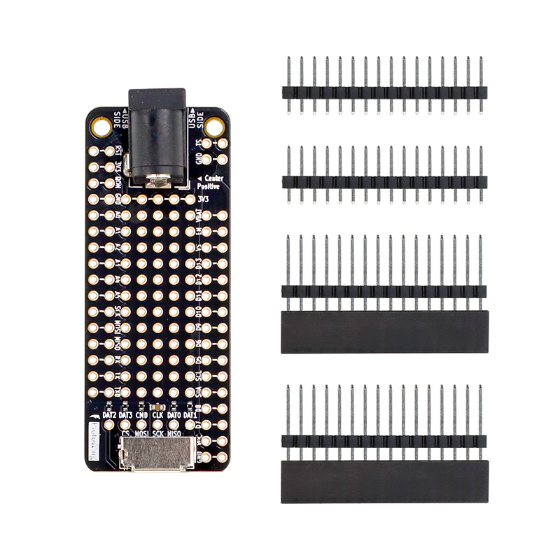
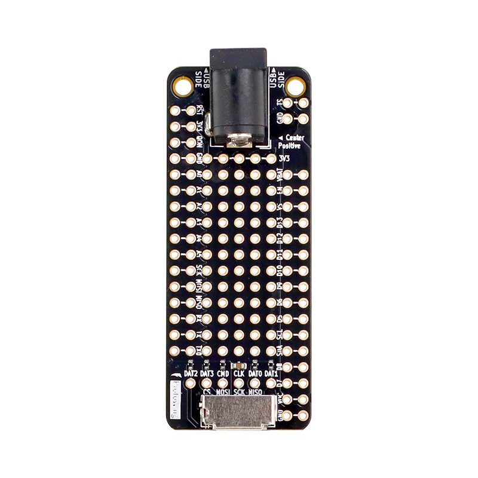

# PowerFeather ProtoWing

## Features

### 🅐 Barrel connector breakout for `VDC` and `GND`

Specifications:

| Attribute | Value |
|-|-|
| Inside Contact Diameter | 2 mm | 
| Outside Contact Diameter | 6.3 mm| 
| Polarity | Center-Positive | 

:::danger
Connecting a center-negative supply may damage PowerFeather and/or the supply.
:::

:::caution
Connect a supply within the specified voltage limits of PowerFeather `VDC`.
:::

:::info
Use the ProtoWing to easily add the [PowerFeather Solar Panel](/hardware/solar_panel) to your project.
:::

### 🅑 Extra 3.3 V and GND taps

### 🅒 Duplicated header pins

### 🅓 Perfboard area

### 🅔 MicroSD breakout

Either the following SD modes are supported by running a wire from the relevant signals to
PowerFeather header pins:

| Mode | Signals | Pin
|-|-|-|
| SDMMC | DAT2, DAT3, CMD, CLK, DAT0, DAT1 | A0 - A5, D5 - D13, TX0, TX, RX, MISO, MOSI, SCK, SCL, SDA
| SPI | CS, MOSI, SCK, MISO |  A0 - A5, D5 - D13, TX0, TX, RX, MISO, MOSI, SCK, SCL, SDA

## Appendix

### Photos

|  |  |  |  |  |  | 
|-|-|-|-|-|-|