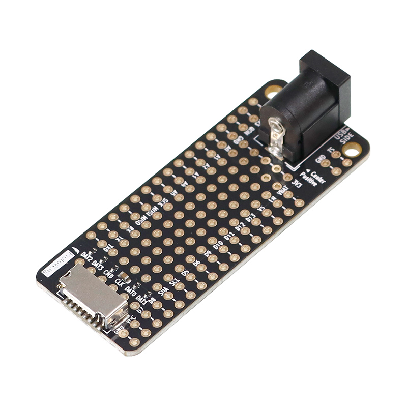

---
keywords:
    - esp32
    - powerfeather
    - prototyping
    - microsd
    - barrel jack
sidebar_position: 1
---

# PowerFeather ProtoWing

## Features

### 🅐 Barrel connector breakout for `VDC` and `GND`

Specifications:

| Attribute | Value |
|-|-|
| Inside Contact Diameter | 2 mm |
| Outside Contact Diameter | 6.3 mm|
| Polarity | Center-Positive |

:::danger
Connecting a center-negative supply may damage PowerFeather and/or the supply.
:::

:::caution
Since the barrel connector just breaks out PowerFeather `VDC`, only connect supplies within
its voltage limits - which is 18 V.
:::

:::info
Use the ProtoWing to easily add the [PowerFeather Solar Panel](/hardware/solar_panel) to your project.
:::

### 🅑 Extra 3.3 V and GND taps

Power additional components and modules from the `3V3` output.

### 🅒 Duplicated header pins

Allows easier connection of multiple leads or wires to header pins.

### 🅓 Perfboard area

An area with pre-drilled holes at 2.54 mm intervals across a grid. Useful for soldering on additional
components or modules.

### 🅔 MicroSD card breakout

Both SDMMC and SPI mode are supported. Users just need to run a wire from the relevant microSD card signal
to PowerFeather header pins:

| Mode | MicroSD Signals | Compatible Header Pins
|-|-|-|
| SDMMC | DAT2, DAT3, CMD, CLK, DAT0, DAT1 | A0 - A5, D5 - D13, TX0, TX, RX, MISO, MOSI, SCK, SCL, SDA
| SPI | CS, MOSI, SCK, MISO |  A0 - A5, D5 - D13, TX0, TX, RX, MISO, MOSI, SCK, SCL, SDA

## Appendix

### Photos

|  |  |  |  |
|-|-|-|-|