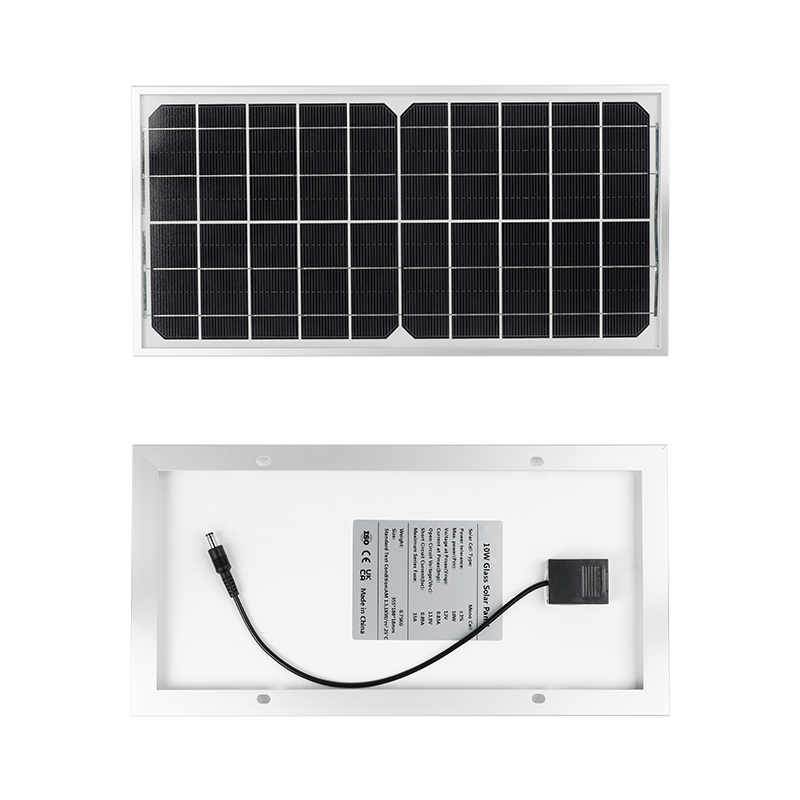
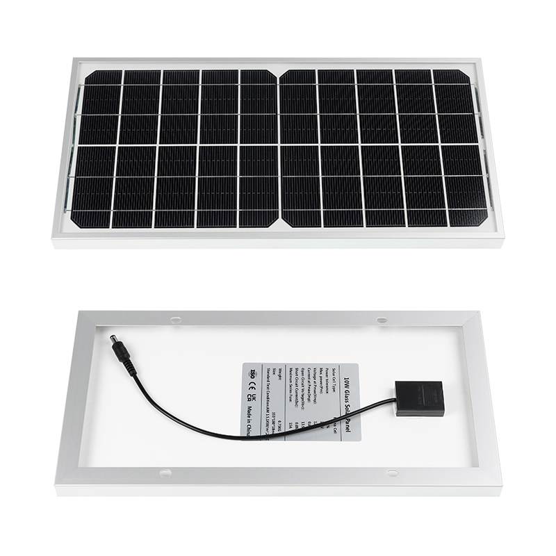
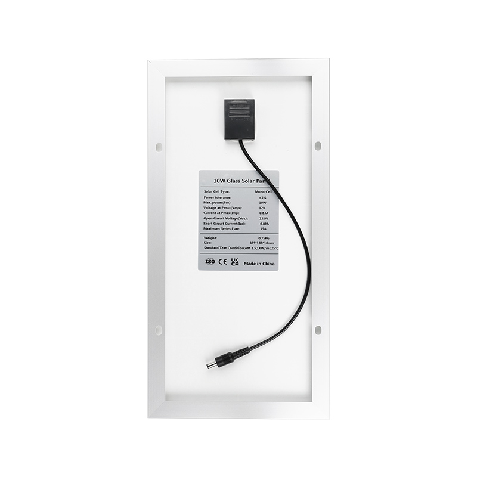
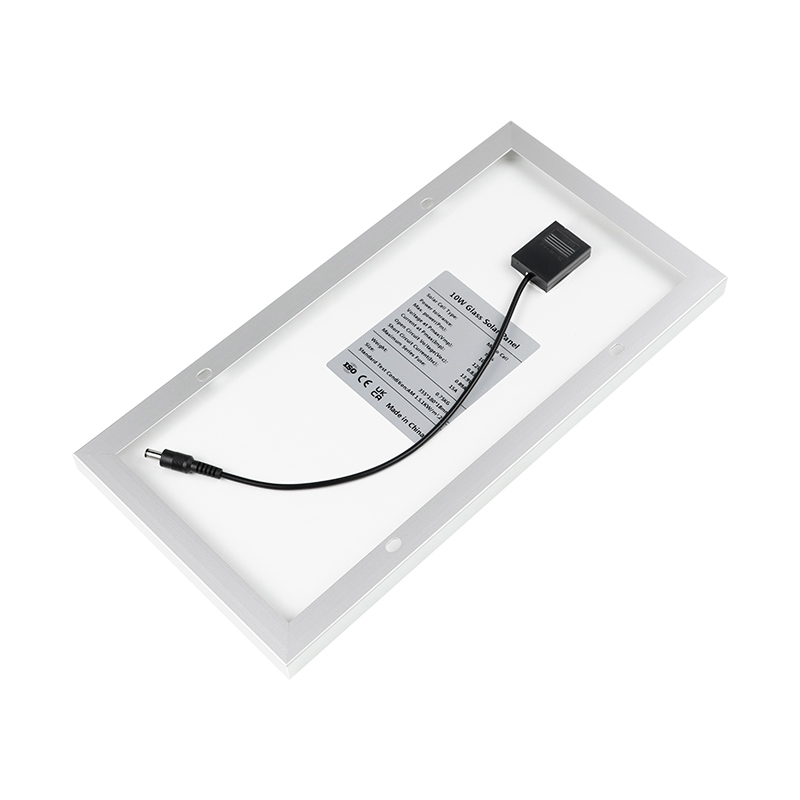
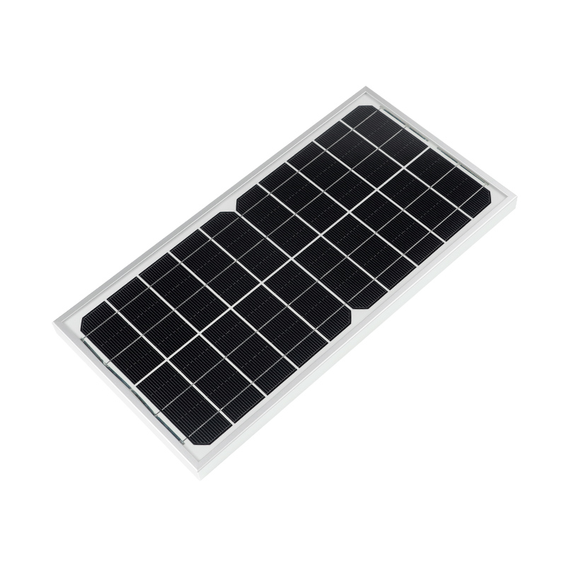

---
keywords:
    - esp32
    - powerfeather
    - solar panel
    - mppt
sidebar_position: 2
---

# PowerFeather Solar Panel

## Specifications

| Attribute | Value |
|-|-|
| Cell Type | Monocrystalline |
| Power | 10 W |
| Vmp (Max Power Point Voltage)  | 12 V |
| Voc (Open Circuit Voltage) | 13.9 V |
| Imp (Max Power Current) | 830 mA |
| Isc (Short Circuit Current) | 890 mA |
| Dimensions | 355 mm x 180 mm x 18 mm |
| Weight | 0.75 kg |
| Cable Length | 30 cm |
| Connector | Center-positive DC5521 |
| Frame | Aluminum |
| Front Cover | Tempered Glass |
| Back Sheet | White |

## Appendix

### Photos

|  |  |  |  |  
|-|-|-|-|-|