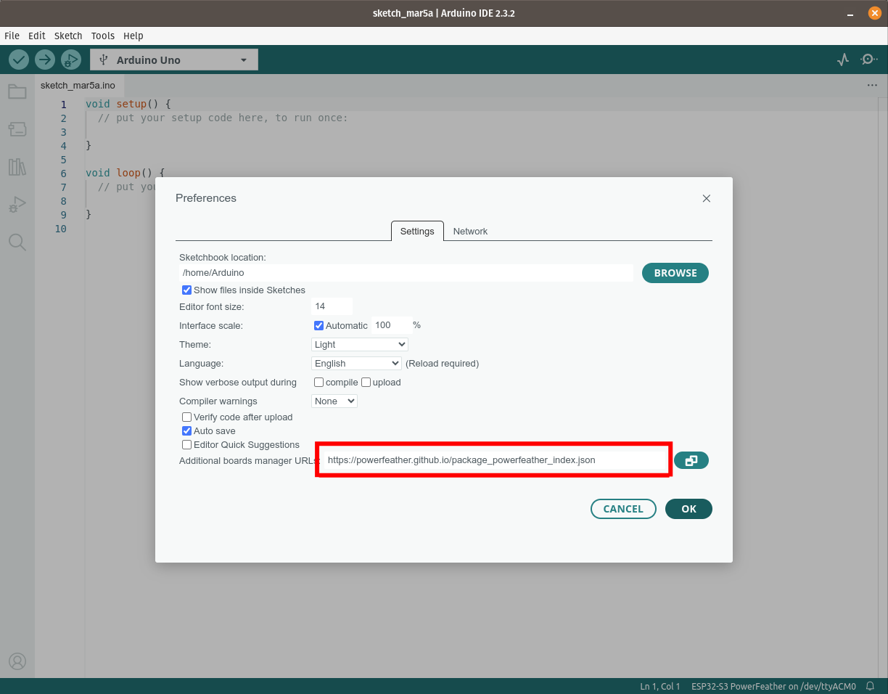
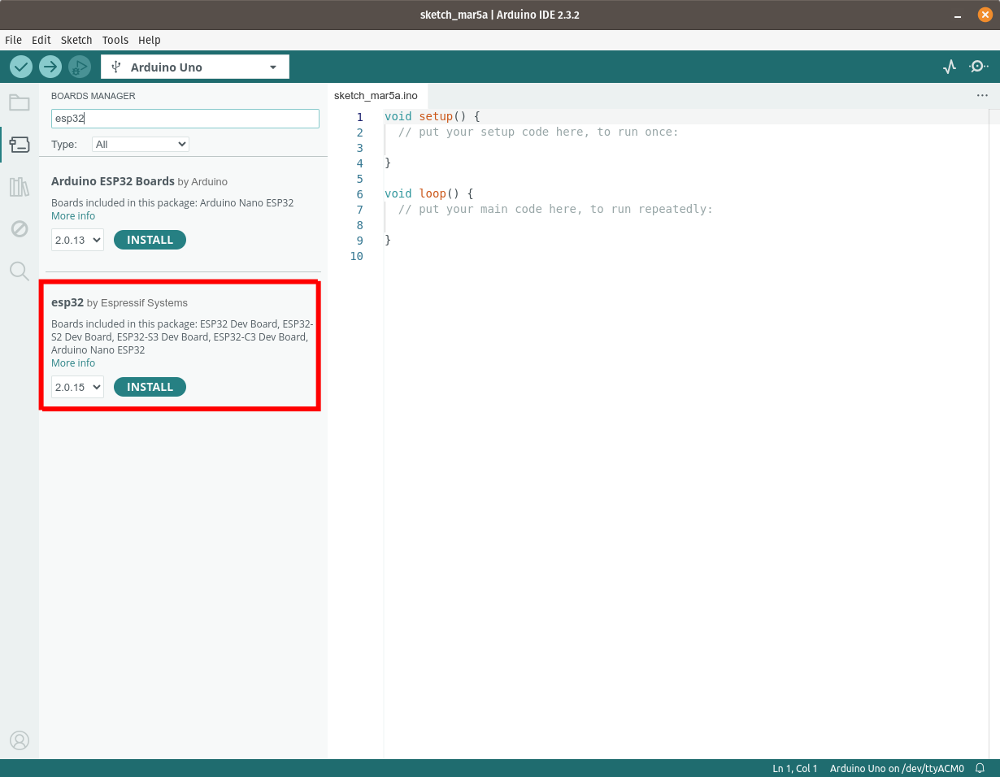
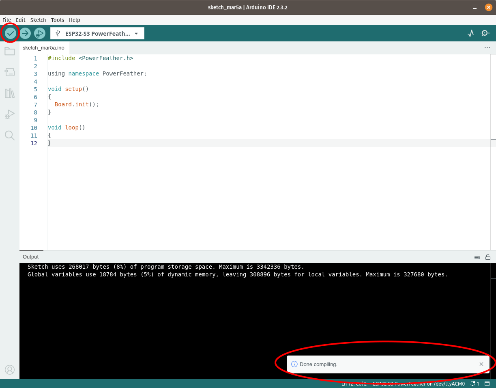
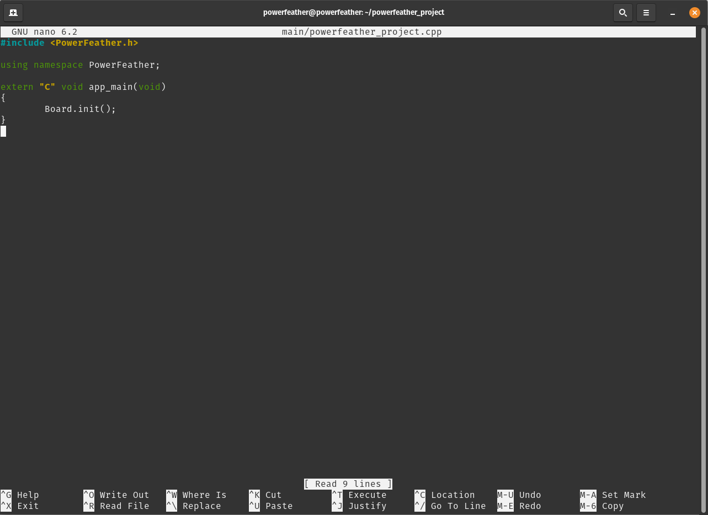
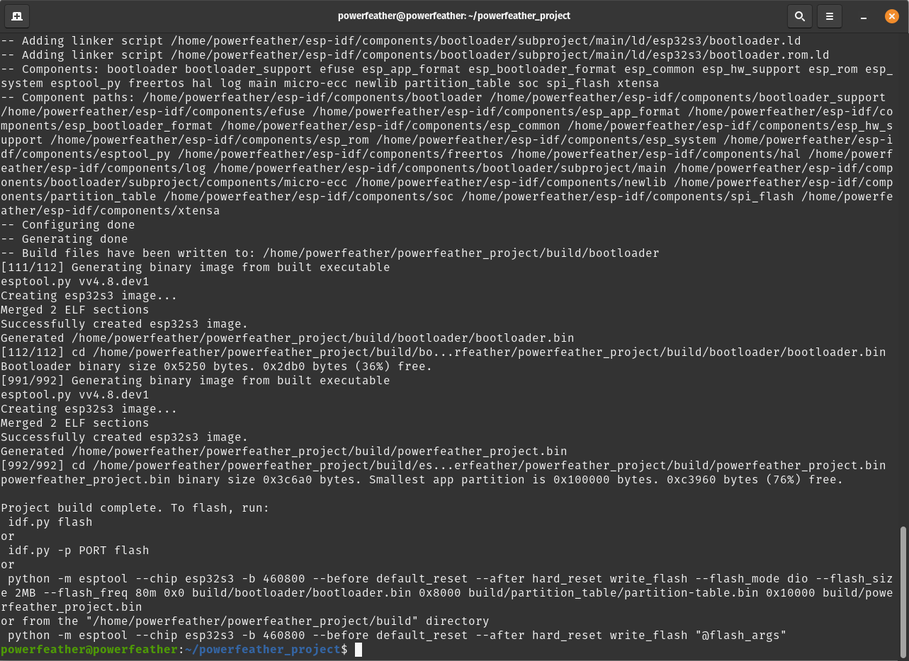

## Arduino

Install the following first:

1. Arduino v2.x or newer. Please follow the [installation instructions for your OS](https://docs.arduino.cc/software/ide-v2/tutorials/getting-started/ide-v2-downloading-and-installing/).

2. Arduino ESP32 v2.0.15 or newer. Please follow the [installation guide from Espressif](https://docs.espressif.com/projects/arduino-esp32/en/latest/installing.html).

    

    

Arduino Library Manager does not install this preview branch directly.

Use exactly one of these two installation methods:

1. [Install the preview SDK from the `v2` branch ZIP in Arduino IDE](#install-from-zip).
2. [Clone the preview SDK into your Arduino libraries folder](#clone-into-the-arduino-libraries-folder).

### Install from ZIP

1. Download the `v2` branch ZIP:

```text
https://github.com/PowerFeather/powerfeather-sdk/archive/refs/heads/v2.zip
```

2. In Arduino IDE, open:

```text
Sketch -> Include Library -> Add .ZIP Library...
```

3. Select the downloaded ZIP file.

### Clone into the Arduino libraries folder

Clone the `v2` preview branch into the Arduino sketchbook libraries directory.

Typical locations are:

- Linux/macOS: `~/Arduino/libraries`
- Windows: `C:\Users\<your-user>\Documents\Arduino\libraries`

Linux/macOS example:

```bash
cd ~/Arduino/libraries
git clone --branch v2 --single-branch https://github.com/PowerFeather/powerfeather-sdk.git PowerFeather-SDK
```

If the directory already exists:

```bash
cd ~/Arduino/libraries/PowerFeather-SDK
git fetch origin
git checkout v2
```

Windows PowerShell example:

```powershell
cd "$HOME\\Documents\\Arduino\\libraries"
git clone --branch v2 --single-branch https://github.com/PowerFeather/powerfeather-sdk.git PowerFeather-SDK
```

If the directory already exists:

```powershell
cd "$HOME\\Documents\\Arduino\\libraries\\PowerFeather-SDK"
git fetch origin
git checkout v2
```

To test if setup was done properly, create a sketch with the following content:

```cpp
#include <PowerFeather.h>

using namespace PowerFeather;

void setup()
{
    Board.init();
}

void loop()
{
}
```

Before building or uploading, set the board revision in Arduino IDE:

```text
Tools -> Board Revision -> ESP32-S3 PowerFeather V2
```

Build the sketch. It should proceed without any errors.



:::info
If you have trouble uploading future sketches, try putting the ESP32-S3 in download mode. This can be done by pressing and
holding `BTN`, pressing `RST` momentarily, and then releasing `BTN`.
:::

## ESP-IDF

ESP-IDF must be installed first. The preview SDK component declares support for ESP-IDF `>=4.4, <=5.5`.
Please follow the installation guide for [Windows](https://docs.espressif.com/projects/esp-idf/en/latest/esp32/get-started/windows-setup.html) or [Linux and macOS](https://docs.espressif.com/projects/esp-idf/en/latest/esp32/get-started/linux-macos-setup.html).

Create a sample project:

```bash
idf.py create-project "powerfeather_project"
```


Navigate into the project directory. Rename `main/powerfeather_project.c` to `main/powerfeather_project.cpp`.


Edit `main/CMakeLists.txt` and change `powerfeather_project.c` to `powerfeather_project.cpp`.


Replace the contents of `main/powerfeather_project.cpp` with:

```cpp
#include <PowerFeather.h>

using namespace PowerFeather;

extern "C" void app_main()
{
    Board.init();
}
```



The `v2` preview branch is not published to the ESP-IDF component registry, so do not use `idf.py add-dependency` for this preview.

Instead, add the preview SDK as a local component checkout inside your project:

```bash
mkdir -p components
git clone --branch v2 --single-branch https://github.com/PowerFeather/powerfeather-sdk.git components/powerfeather-sdk
```

Before building, configure the board revision in Kconfig:

```bash
idf.py menuconfig
```

Then select:

```text
Component config -> PowerFeather-SDK -> ESP32-S3 PowerFeather board revision -> ESP32-S3 PowerFeather V2
```

Then run:

```bash
idf.py reconfigure
idf.py set-target esp32s3
idf.py build
```

If everything was set up correctly, the build should proceed without any compilation errors.


