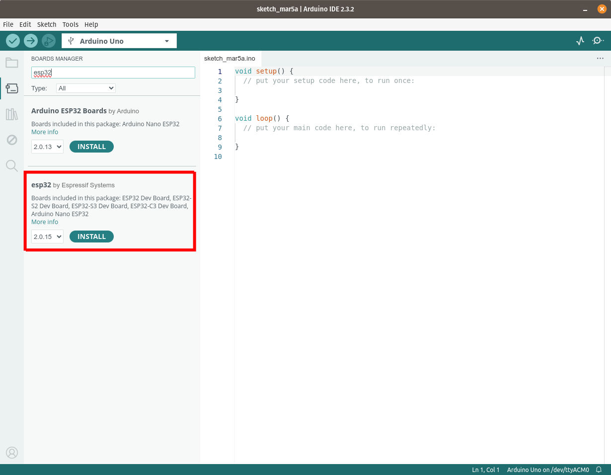
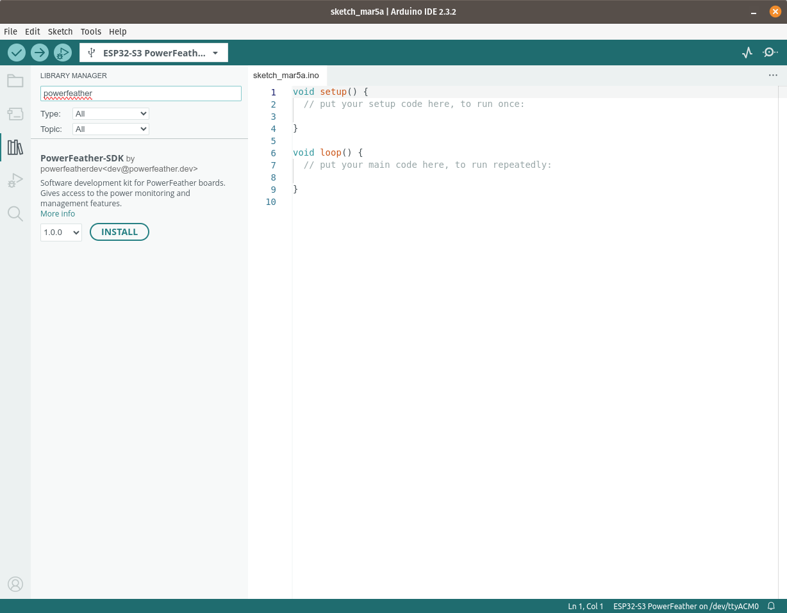
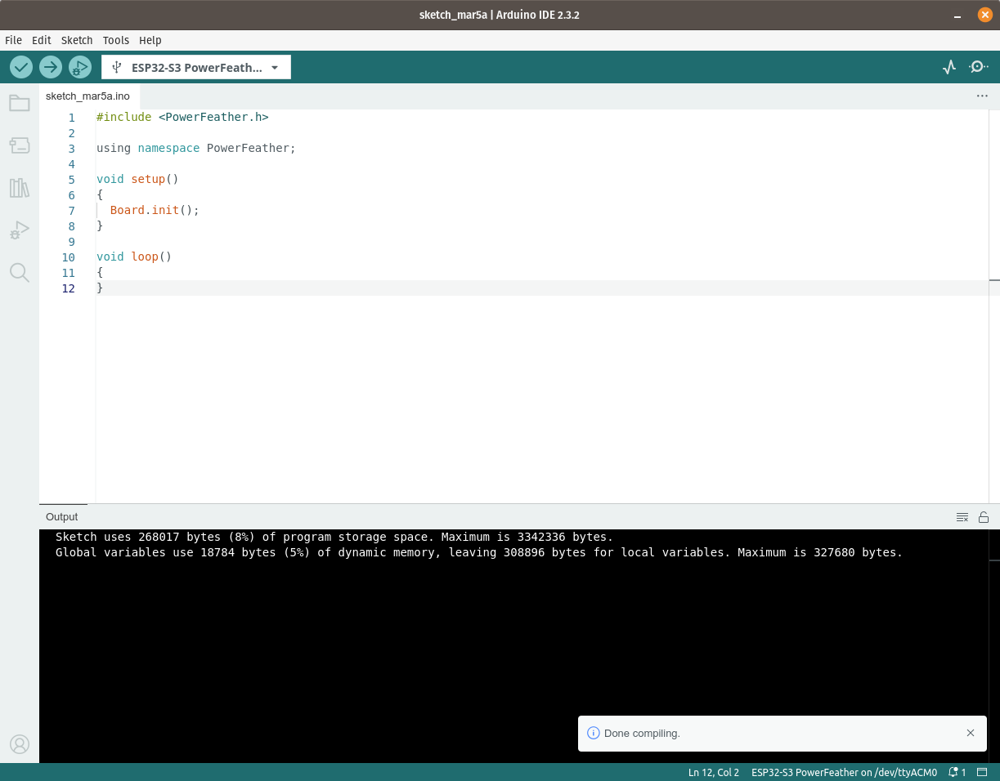

# Setup

## Arduino

Arduino IDE needs to be [installed](https://docs.arduino.cc/software/ide-v2/tutorials/getting-started/ide-v2-downloading-and-installing/) first. Arduino IDE v2 or newer is recommended. Once done, Arduino ESP32 also needs to be [installed](https://docs.espressif.com/projects/arduino-esp32/en/latest/installing.html).



After Arduino ESP32 has been installed, PowerFeather-SDK can now be installed. Follow the [instructions for installing a library](https://docs.arduino.cc/software/ide-v2/tutorials/ide-v2-installing-a-library/), with the name of the library being `PowerFeather-SDK`.



To test whether the setup has been done successfuly, we'll create the minimal Arduino sketch for PowerFeather:

```cpp
#include <PowerFeather.h>

using namespace PowerFeather;

void setup()
{
    Board.init();
}

void loop()
{
}
```

The most important thing is for the sketch to call [Mainboard::init](api/mainboard.md#result-inituint16_t-capacity--0) (`Base.init()` above). Build the sketch, it should proceed without any errors.




## ESP-IDF

ESP-IDF needs to be installed first. PowerFeather-SDK requires ESP-IDF v5.1 or newer.
Please follow Espressif's installation guide for [Windows](https://docs.espressif.com/projects/esp-idf/en/latest/esp32/get-started/windows-setup.html) or [Linux and macOS](https://docs.espressif.com/projects/esp-idf/en/latest/esp32/get-started/linux-macos-setup.html).

To demonstrate adding PowerFeather-SDK to an ESP-IDF project, we'll create a sample project.
Open a terminal with the ESP-IDF environment set up on [Windows](https://docs.espressif.com/projects/esp-idf/en/latest/esp32/get-started/windows-setup.html#launching-esp-idf-environment) or [Linux and macOS](https://docs.espressif.com/projects/esp-idf/en/latest/esp32/get-started/linux-macos-setup.html#step-4-set-up-the-environment-variables). Navigate to a directory where the sample ESP-IDF project can be created, and enter the command:

```bash
idf.py create-project "powerfeather_project"
```

Navigate into the created sample ESP-IDF project directory.

Rename `main/powerfeather_project.c` to `main/powerfeather_project.cpp`. Also, edit `main/CMakeLists.txt`.
Edit the `main.cpp` file inside the `main` directory to include.


```cpp
#include <PowerFeather.h>

using namespace PowerFeather;

extern "C" void app_main()
{
    Board.init();
}
```


Enter the command:
```bash
idf.py add-dependency "powerfeatherdev/powerfeather-sdk^0.9.3"
```

Build the sample project by issuing the command:

```
idf.py build
```

If everything was set up correctly, the build should proceed without any compilation errors.