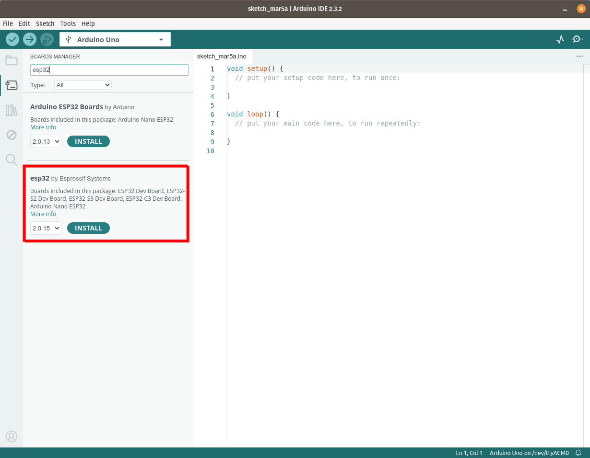

---
keywords:
    - esp32
    - powerfeather
    - sdk
    - setup
    - install
    - arduino
    - esp-idf
sidebar_position: 0
---

# Setup

## Arduino

Install the following:

1. Arduino v2.x or newer. Please follow the [installation instructions for your OS](https://docs.arduino.cc/software/ide-v2/tutorials/getting-started/ide-v2-downloading-and-installing/).

2. Arduino ESP32 v2.0.15 or newer. Please follow the [installation guide from Espressif](https://docs.espressif.com/projects/arduino-esp32/en/latest/installing.html).

    

    

3. PowerFeather-SDK 1.0.0 or newer. Follow the [instructions for installing a library](https://docs.arduino.cc/software/ide-v2/tutorials/ide-v2-installing-a-library/).

    

To test if setup was done properly, create a sketch with the following content:

```cpp
#include <PowerFeather.h>

using namespace PowerFeather;

void setup()
{
    Board.init();
}

void loop()
{
}
```

The above is the minimal sketch code for PowerFeather, which just initializes the board hardware.
Build the sketch, it should proceed without any errors.


> **_NOTE:_**  If you have trouble uploading future sketches, try putting the ESP32-S3 in download mode. This can be done by pressing and
> holding the `BTN`, pressing the `RST` momentarily, and then releasing the `BTN`.

## ESP-IDF

ESP-IDF needs to be installed first. PowerFeather-SDK requires ESP-IDF v4.4 or newer.
Please follow the installation guide for [Windows](https://docs.espressif.com/projects/esp-idf/en/latest/esp32/get-started/windows-setup.html) or [Linux and macOS](https://docs.espressif.com/projects/esp-idf/en/latest/esp32/get-started/linux-macos-setup.html).

To demonstrate adding PowerFeather-SDK to an ESP-IDF project, we'll create a sample one.
Open a terminal with the ESP-IDF environment loaded on [Windows](https://docs.espressif.com/projects/esp-idf/en/latest/esp32/get-started/windows-setup.html#launching-esp-idf-environment) or [Linux and macOS](https://docs.espressif.com/projects/esp-idf/en/latest/esp32/get-started/linux-macos-setup.html#step-4-set-up-the-environment-variables). Navigate to a directory where the sample ESP-IDF project can be created, and run the command:

```bash
idf.py create-project "powerfeather_project"
```


Navigate into the created sample ESP-IDF project directory. Rename `main/powerfeather_project.c` to `main/powerfeather_project.cpp`. Your project tree should look like the following:


Edit `main/CMakeLists.txt` and change `powerfeather_project.c` to `powerfeather_project.cpp`, to reflect the rename done in the previous step.


Replace the contents of `main/main.cpp` with the following:

```cpp
#include <PowerFeather.h>

using namespace PowerFeather;

extern "C" void app_main()
{
    Board.init();
}
```

The above is the minimal ESP-IDF project code for PowerFeather, which just initializes the board hardware.


To add PowerFeather-SDK as a component for the sample ESP-IDF project, run the command:
```bash
idf.py add-dependency "powerfeather/powerfeather-sdk^1.0.0"
```


Build the sample ESP-IDF project by issuing the commands:

```bash
idf.py set-target esp32s3
idf.py build
```

If everything was set up correctly, the build should proceed without any compilation errors.


